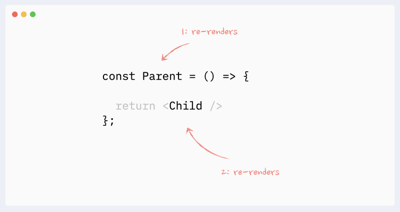
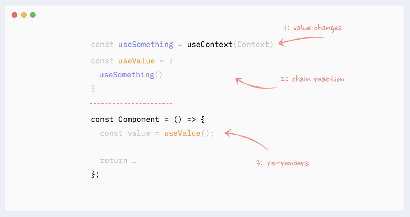

## چرا باید جزئیات رندر ها را بدانیم ؟

به تبدیل کد به تصویری که در نهایت در صفحه دیده می شود رندر گفته می شود. اگر بخشی در صفحه تغییر کند به آن رندر دوباره (ری رندر) گفته می شود.  
ری اکت در رندر سریع نیست. به همین دلیل مهم ترین ابزار ما برای سرعت بخشیدن به محصولاتی که با ری اکت طراحی می شوند کم کردن تعداد رندر هاست.

### کامپوننت ها کی ری رندر می شوند ؟

ری اکت به طور خودکار نیاز به ری رندر یک بخش از صفحه را تشخیص می دهد. در عمل خیلی اوقات این تشخیص دقیق نیست و بخش هایی ری رندر می شوند که نیاز به ری رندر ندارند.

## دلایل ری رندر

### تغییر state

اگر state ای در یک کامپوننت تغییر کند آن کامپوننت ری رندر خواهد شد.  
تغییر state دلیل اصلی ری رندر ها در ری اکت است

### ری رندر parent

اگر parent یک کامپوننت ری رندر شود آن کامپوننت نیز ری رندر خواهند شد.

### تغییرات context

اگر مقداری در یک ContextProvider تغییر کند تمام کامپوننت هایی که از آن context استفاده می کنند ری رندر خواهند شد. حتی اگر از مقداری که تغییر کرده استفاده نکنند  
!

### تغییرات hook

هوکی که در یک کامپوننت استفاده شود «متعلق» به ان کامپوننت است. در نتیجه اگر قوانین مربوط به ری رندر برای state و context اینجا هم وجود دارند و تغییرات این دو درون هوک می توانند منجر به ری رندر شوند  

:::tip مطالعه

-   [New react docs: Preserving and Resetting State](https://react.dev/learn/preserving-and-resetting-state)
-   [Old react docs: reconcilation](https://legacy.reactjs.org/docs/reconciliation.html)
-   [React re-renders guide: why React components re-render](https://dev.to/adevnadia/react-re-renders-guide-why-components-re-render-4ml)

:::
