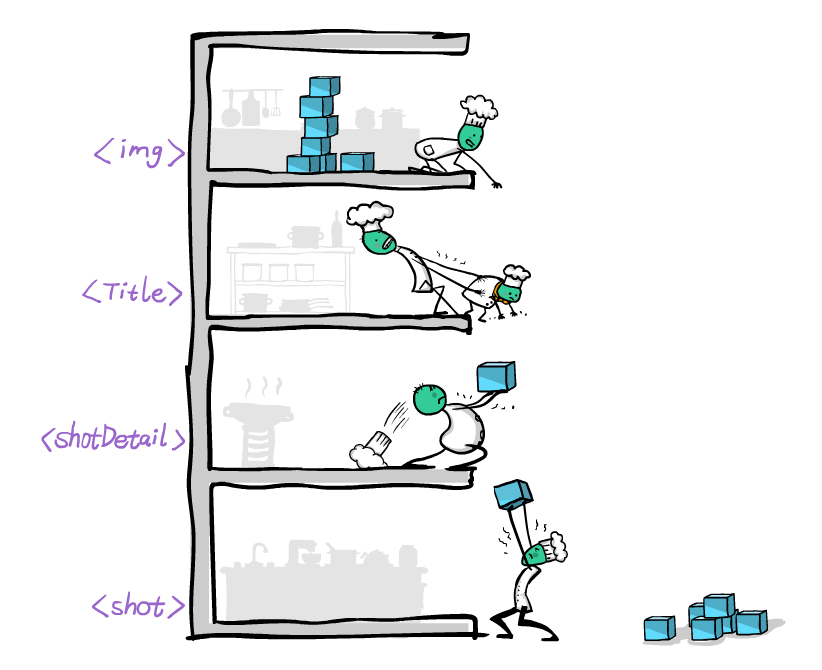

## مقدمه 

تا به اینجای پروژه ها دید که برای جابه جایی داده بین کامپونتت ها باید از prop ها و event ها استفاده کنیم.

خب این موضوع زمانی که تعداد کامپوننت های تودر تو زیاد میشه میتونه خیلی ازار دهنده بشه و برای یک تغییر خیلی کوچیک کلی فایل تغییر کنه.

حالت زیر حالت کنونی ما هست که داریم:


حالا فرض کنید همه داده ها در یک فضای مرکزی نگهداری کنیم و از همه جا بهش دسترسی داشته باشیم


به این فضای مرکزی که نگهدارنده داده های ما هست store میگوییم حالا در این وضعیت دیگر نیاز به استفاده از props ها و event ها خیلی کم میشه و ما میتونیم داده های مشترکی که چندین کامپوننت به انها نیاز دارند در store نگهداری کنیم

و با store تمامی کامپوننت هایی که از ان استفاده کردن رندر مجدد میشوند 

با این حالت کد تمیزتری داریم و تغییرات که در اینده بخواهیم به برنامه بدیم ساده میشود.

## ContextApi

### ساخت Store
یکی از روش های ساخت store در ریکت استفاده از contextApi است که خود ریکت اون را در اختیار ما گذاشته و نیازی به نصب وابستگی جدیدی نداریم

با هم بریم یک store بسازیم به مثال زیر دقت کنید: 

```javascript
const { createContext, useState } = require("react");


const GlobalContext = createContext(null);
const GlobalInitValue = {
    title: 'This is context api app',
    themeDark: 'light',
    todos: {}
}


const GlobalState = ({ children }) => {

    const [title, setTitle] = useState(GlobalInitValue.title);
    const [theme, setTheme] = useState(GlobalInitValue.themeDark);
    const [todos, setTodos] = useState(GlobalInitValue.todos);
    // we can use useReducer 


    const globalContextValue = {
        title, setTitle,
        theme, setTheme,
        todos, setTodos
    };


    return (
        <GlobalContext.Provider value={globalContextValue}>
            {children}
        </GlobalContext.Provider>
    ); 
}
 
export { GlobalContext };
export default GlobalState;
```

مثال بالا برای ما یک store درست کرده است که میتوانیم در هرکجای برنامه نیاز داریم ان را provide کنیم تا در دسترس ما باشید.

```javascript
const GlobalContext = createContext(null);
```

این خط در واقع برای ما یک store ساخته و بعد ان را کانفیگ کردیم و درون ان تعدادی useState ریخته ایم تا با تغییر انها ریکت متوجه رندر مجدد صفحه شود.

در نهایت ان را بصورت component در اوردیم و مقادیر useState را به ان دادیم تا شروع به کار کند.

برای این که ان را provide کنیم تا قابلیت دسترسی به ان را داشته باشیم در app.js ان را فراخوانی میکنیم به مثال زیر دقت کنید:

```javascript
import { BrowserRouter, Route, Routes } from "react-router-dom";
import Layout from "./pages/layout";
import HomePage from "./pages/home-page";
import AboutPage from "./pages/about-page";
import GlobalState from "./GlobalState";

function App() {
  return (
    <div >
      <BrowserRouter>
        <GlobalState>
          <Routes>
            <Route path="/" element={<Layout />}>
                <Route index element={<HomePage  />}/>
                <Route path="/about" element={<AboutPage  />}/>
            </Route>
          </Routes>
        </GlobalState>
      </BrowserRouter>
    </div>
  );
}

export default App;
```

حالا با provide کردن ان تمامی فرزندان ان به store ما دسترسی دارند

### فراخوانی داده ها  - useContext 

حالا که داده ها قابلیت دسترسی در کل برنامه را ( زیر فرزند ها ) دارند با هم در لایه بیایم به صفحات یک عنوان بدیم و در هر صفحه عنوان به خصوصی تنظیم کنیم

ابتدا ان را در لایه فراخوانی میکنیم:

```javascript
import { useContext } from "react";
import { Link, Outlet } from "react-router-dom";
import { GlobalContext } from "../GlobalState";

const Layout = () => {
    const {title} = useContext(GlobalContext);

    return ( 
        <div >
            <nav>
                <h1>{title}</h1>
                <ul>
                    <li><Link to={'/'}>Home</Link></li>
                    <li><Link to={'/About'}>About</Link></li>
                </ul>
            </nav>
            <div>
                <Outlet />
            </div>
        </div>
     );
}
 
export default Layout;
```

با صدا کردن هوک useContext و پاس دادن context ی که ساخته به اون میتونیم داده های درون ان را دریافت کنیم.

عنوان را دریافت میکنیم و ان را در لایه نمایش میدهیم

### تغییر داده ها - useContext

حالا که عنوان ما نمایش داده شده و مقدار پیش فرض درون است نیاز داریم در هر صفحه ان را تغییر دهیم.

```javascript
import { useContext, useEffect } from "react";
import { GlobalContext } from "../GlobalState";

const HomePage = () => {
    const { setTitle } = useContext(GlobalContext);

    useEffect(() => {
        setTitle('Home Page');
    }, []);

    return ( 
        <div>
            HomePage
        </div>
     );
}
 
export default HomePage;
```

این بار به جای اینکه  title را از store دریافت کنیم dispatcher ان را دریافت میکنیم و setTitle میکنیم.

همین کار را برای صفحه درباره ما میکنیم:

```javascript
import { useContext, useEffect } from "react";
import { GlobalContext } from "../GlobalState";


const AboutPage = () => {
    const { setTitle } = useContext(GlobalContext);
    
    useEffect(() => {
        setTitle('About Page');
    }, []);

    return ( 
        <div>
            AboutPage
        </div>
     );
}
 
export default AboutPage;
```

 حالا دیگر نیازی به props ها و event های زیادی نداریم و هرجا نیاز به store مرکزی خود داشته باشیم با useContext ان را دریافت میکنیم و نمایش یا تغییر میدهیم.

---
## پروژه

استفاده از context api در پروژه ویترین و صفحه ساز
