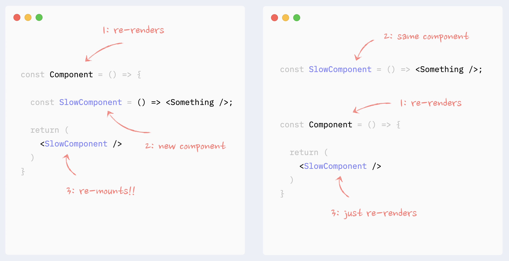
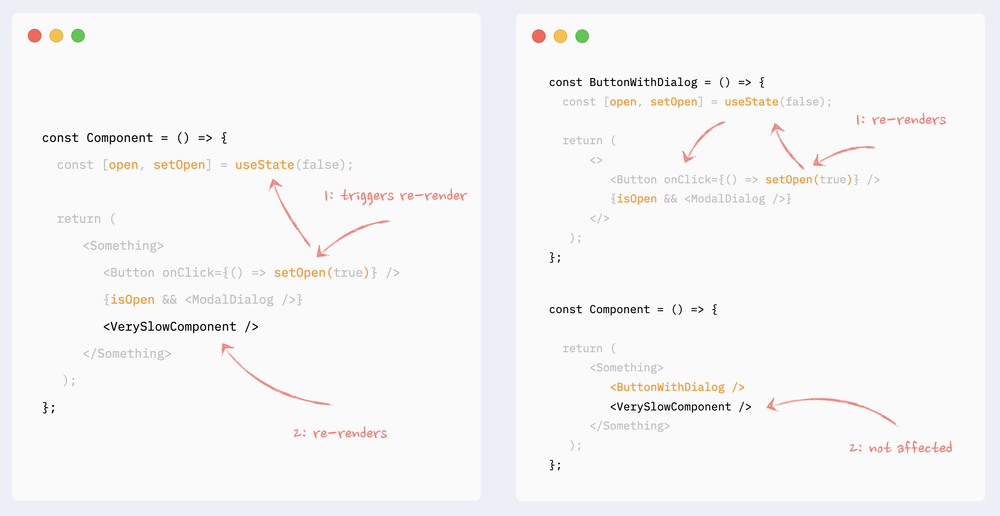
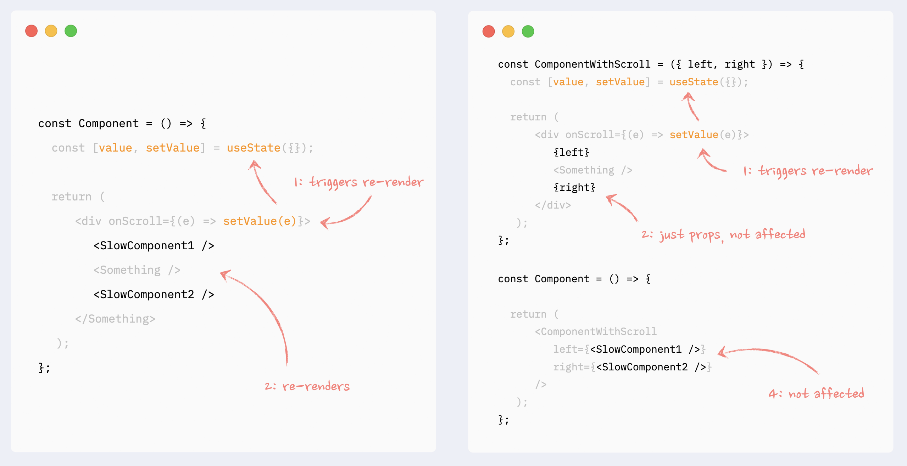
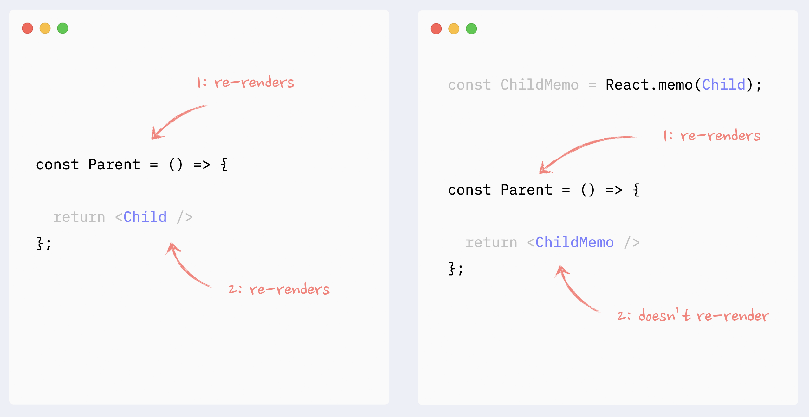
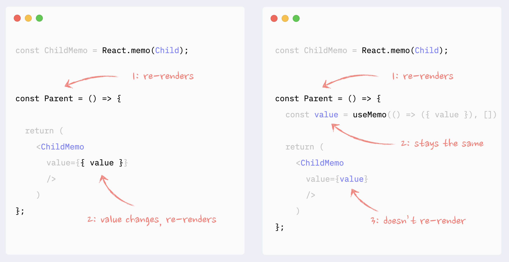

## طرز تهیه یک اپ ری اکت بهینه

هماهنطور که در بخش قبل دیدیم ری اکت بخاطر تضمین آپدیت موندن اطلاعات شدیدا علاقه مند به رندر کردن دوباره کامپوننت هاست. برای بهینه سازی این رندر ها و سبک کردنشان نکات و ابزاری وجود دارند که بررسیشون می کنیم

### اصل Single source of truth

بار ها در کامپوننت ها به نقاطی می رسیم که چند state داریم. خیلی اوقات این state ها حدی از ارتباط رو با هم دارن که باعث میشه حداقل بعضی اوقات در صورت تغییر یکی، دیگری هم تغییر کنه و دو رندر متوالی داشته باشیم.  
این مشکل رو میشه با جدا سازی بخش مشترک state ها و قرار دادنش در یک استیت جدید حل کرد.  
به طور مثال کامپوننت ورودی زیر رو در نظر بگیرید:

```jsx
function Input() {
    [value, setValue] = useState('');
    [isTouched, setIsTouched] = useState(false);
    return (
        <input
            value={value}
            onChange={(e) => {
                setValue(e.target.value);
                setIsTouched(true);
            }}
        />
    );
}
```

این کامپوننت برای بررسی دست خورده بودن ورودی و نشان دادن ارور از isTouched و برای نگهداری مقدار تایپ شده از value استفاده می کنه.
اما لحظه ای که اولین کاراکتر تایپ میشه هر دو state تغییر می کنند و دو رندر متوالی داریم.

در این حالت میشه از یک استیت جدید به عنوان single source of truth استفاده کرد و هر دو state رو در اون قرار داد تا جلوی رندر متوالی گرفته بشه.

```jsx
function Input() {
    [input, setInput] = useState({value: '', isTouched: false});
    return (
        <input
            value={input.value}
            onChange={(e) => {
                setInput({value: e.target.value, isTouched: true});
            }}
        />
    );
}
```

راه حل قویتر استفاده از useReducer هست که شاید در این مثال کمی اضافی به نظر برسه ولی بهمون اطمینان میده که در صورت اضافه شدن state های جدید به کامپوننت هم مشکلی پیش نمیاد چون میشه به جای تصور مستقیم state ها، نتایج یک عمل مشخص رو تصور کنیم و تغییرات لازم رو اعمال کنیم.

```jsx
function Input() {
    const [input, dispatch] = useReducer(
        (state, action) => {
            switch (action.type) {
                case 'SET_VALUE':
                    return {...state, value: action.payload, isTouched: true};
                default:
                    return state;
            }
        },
        {value: '', isTouched: false}
    );
    return (
        <input
            value={input.value}
            onChange={(e) => {
                dispatch({type: 'SET_VALUE', payload: e.target.value});
            }}
        />
    );
}
```

:::danger نکته
استفاده از useReducer همیشه خوب نیست. در این مورد میتونید [بخش مربوط به این انتخاب رو](https://react.dev/learn/extracting-state-logic-into-a-reducer#comparing-usestate-and-usereducer) تو داک ری اکت بخونید.
:::

### نساختن یک کامپوننت در بدنه کامپوننت دیگر

این کار باعث re-mount علاوه بر ری رندر می شود. در واقع ری اکت این کامپوننت را حذف و دوباره از صفر ساخته و در جای قبلی قرار می دهد که بسیار کند تر از ری رندر است.  
:::caution نکته
این کار باعث می شود lifecycle کامپوننت نیز بهم ریخته و مثلا useEffect دوباره اجرا شود یا برای لحظه ای جای کامپوننت در DOM سفید یا خالی شود
:::


### پایینتر بردن state و کامپوننت ساختن دور استیت های بدون ارتباط

این الگو تلاش می کند هر state پس از تغییر کمترین بخش ممکن را ری رندر کند. به طور مثال اگر استیت یک checkbox در کامپوننت پدر که کل فرم را مدیریت می کند ذخیره شود، کل فرم وقتی تیک checkbox را بزنیم ری رندر می شود. اما اگر استیت checkbox در کامپوننت خود checkbox ذخیره شود، فقط checkbox ری رندر می شود.


### استفاده از props به جای رندر مستقیم

این الگو نیز مانند قبلی به جدا کردن state ها اشاره می کند.  
اگر یک المنت به عنوان یک پراپ یا children که خود نیز مانند یک پراپ معمولی است دریافت شود، ری رندر تاثیری بر روی این کامپوننت نخواهد داشت


:::tip جزئیات بیشتر

-   [React component as prop: the right way™️](https://www.developerway.com/posts/react-component-as-prop-the-right-way)
-   [The mystery of React Element, children, parents and re-renders](https://www.developerway.com/posts/react-elements-children-parents)

:::

### استفاده از useMemo و useCallback

استفاده از این دو هوک یکی از روش های اصلی بهینه سازی رندر هاست که در این مورد با جزئیات در بخش [useCallback & useMemo](./08-react-useCallback-useMemo.md) صحبت شده.  
جزئیات مربوط به استفاده از آنها با React.memo در ادامه بررسی می شوند

### React.memo

این تابع تلاش می کنه تا وقتی پراپ های یک کامپوننت تغییر نکرده باشند، ری رندری اتفاق نیوفته.
در واقع شبیه useMemo عمل میکنه ولی برای کامپوننت کامل.


برای اینکه React.memo درست کار کنه و ری رندری اتفاق نیوفته علاوه بر خود کامپوننت، تمام پراپ های غیر primitive هم باید با useMemo یا روش دیگه ای memoize شن  
:::caution دلیل این کار اینه که رفرنس پراپ های غیر پریمیتیو بعد از ری رندر پدر تغییر میکنه، و همین تغییر برای ری رندر کافیه. در نتیجه React.memo میتونه اشتباهی ری رندر کنه  
:::


:::tip مطالعه بیشتر
[React re-renders guide: everything, all at once
](https://www.developerway.com/posts/react-re-renders-guide#part2.5)
:::
