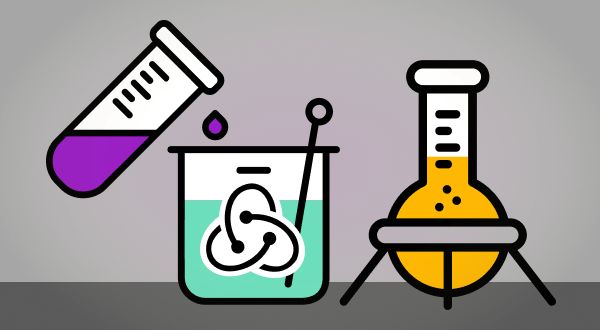
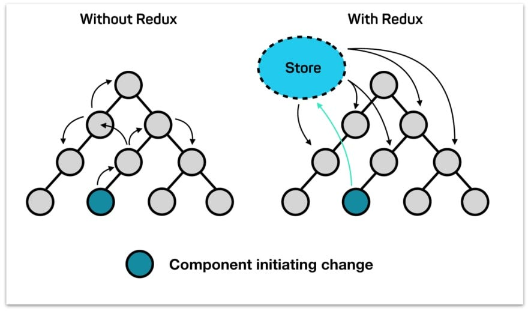
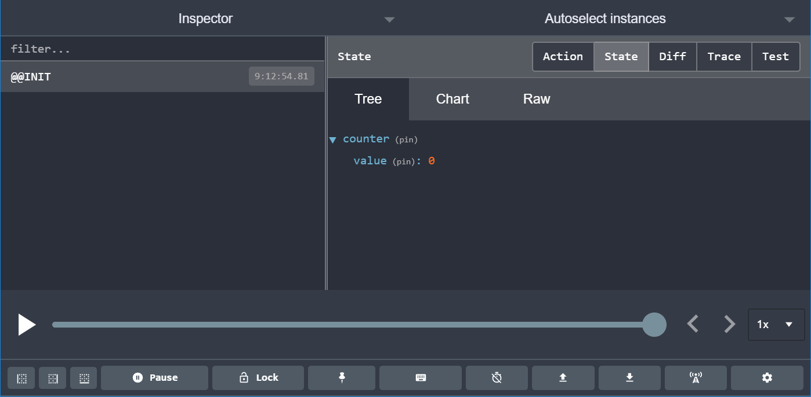

## مقدمه

در ریداکس ما به جای استفاده مستقیم از state ها و تغییر اونها از سیستمی مشابه state machiene ها استفاده می کنیم. شاید اسمشونو تو بحث بازی سازی یا سخت افزار شنیده باشید.  
تو این سیستم یک سری عمل (action) تعریف می کنیم و هر وقت تصمیم داریم تغییری اتفاق بیوفته این اعمال رو انجام میدیم. اینکه این اعمال چطور state ها رو تغییر میدن تو لایه دیگه ای طراحی میشه و توی کامپوننت ما فقط تعدادی action انجام میدیم (به دستور انجام اعمال dispatch گفته میشه).  
این کار علاوه بر تمیزی کد، باعث میشه حتی کمتر منطق برنامه با بخش نمایش (view) ترکیب شه.  
این اکشن ها همه به یه store می رسن که کل state های برنامه رو نگه میداره. و توسط موجوداتی به نام reducer تحلیل می شن و تغییرات لازم توی store (state ها) رو اعمال می کنن.  
شاید به نظر خیلی پیچیده بیاد ولی در عمل کمی که باهاش آشنا شید ساده میشه. کل این ماجرا رو می شه تو انیمیشن زیر دید.


## Store

برای شروع اول باید با این مفهوم آشنا بشیم که store چیه ؟

store مثل یه container میمونه که کل اطلاعات اپلیکیشن رو برامون نگهداری میکنه و شما میتونید انواع دیتا ها مثل string ها اعداد boolean آبجکت ها ، آرایه ها و حتی فانکشن ها رو در اون ها ذخیره کنید .

همچنین state ها رو میشه به عنوان single source of truth در نظر گرفت یعنی اینکه همه ی کامپوننت ها می تونن داخل اپلیکیشن به بهش دسترسی داشته باشن و دیتا رو دریافت و آپدیت کنن



برای ایجاد کردن store زملنی که از redux toolkit استفاده میکنیم داخل source پروژمون یه فایل به اسم `store.js` ایجاد میکنیم . بعد از اون تابع `configureStore()` رو داخل فایلمون import میکنیم و یه استور خالی ایجاد میکنیم

```jsx
import {configureStore} from '@reduxjs/toolkit';

export const store = configureStore({
    reducer: {},
});
```

این کد یه store برامون ایجاد میکنه و همینطور redux devTools رو برامون configure میکنه که بهمون کمک میکنه در طول develope کردن store رو مشاهده کنیم  

:::tip  
اکستنشن chrome رو میتونید از لینک زیر دانلود کنید
[redux dev tools](https://chrome.google.com/webstore/detail/redux-devtools/lmhkpmbekcpmknklioeibfkpmmfibljd)
:::

بعد از اینکه store رو ساختیم کامپننت ر`<App/>` رو با استفاده از `<provider>` که react-redux در اختیارمون قرار داده wrap میکنیم store رو هم import کرده و به عنوان props بهprovider پاس میدیم .

```JSX
import React from 'react'
import ReactDOM from 'react-dom'
import './index.css'
import App from './App'
//Importing the store we created above
import { store } from "./redux/store"
//importing the provider from react-redux
import { Provider } from 'react-redux'

ReactDOM.render(
    //This makes the store accessible to the App that is passing it as a prop
  <Provider store={store}>
    <App />
  </Provider>,
  document.getElementById('root')
)

```

## slice

خب ، حالا که فهمیدیم چطور توی redux toolkitباید یه store رو ایجاد کنیم و برای کامپوننت های app دسترس پذیر کنیم به مفهومی به اسم slice میرسیم  
 slice های ریداکس یه مجموعه ای از reducer ها وaction creator ها و initial state هستن که داخل یه فایل توی دایرکتوری features قرار میگیرن و جزو store به حساب میان .

با کمک slice ما میتونیم کد های ریداکسمون رو بهتر سازماندهی کنیم و نگهداری کد برامون راحت تر میشه

بعد از اینکه slice رو ساختیم و reducer و action هامون رو داخلش تعریف کردیم reducer رو export میکنیم . با این کار میتونیم از reducer ها داخل store استفاده کنیم .

```javascript
//features/counter/counterSlice.js
import {createSlice} from '@reduxjs/toolkit';

const initialState = {
    count: 0,
};

export const counterSlice = createSlice({
    name: 'counter',
    initialState,
    reducers: {
        increment: (state) => {
            state.count += 1;
        },
        decrement: (state) => {
            state.count -= 1;
        },
        incrementByAmount: (state, action) => {
            state.count += action.payload;
        },
    },
});

// Action creators are generated for each case reducer function
export const {increment, decrement, incrementByAmount} = counterSlice.actions;

export default counterSlice.reducer;
```

بعد از اینکه reducer رو export کردیم ، اون رو داخل فایل store.js ایمپورت میکنیم و و به store اضافه میکنیمو با این کا پیکر بندی storeتکمیل میشه

```javascript
//store.jsx
import {configureStore} from '@reduxjs/toolkit';
//Importing the reducer from countSlice
import counterReducer from './countslice';

export const store = configureStore({
    reducer: {
        counter: counterReducer,
    },
});
```

## middleware

در Redux، Middleware (واسطه‌نرم‌افزار) یک مفهوم مهم و قدرتمنده که به شما اجازه می‌دهد تا در فرآیند اجرای اکشن‌ها به میانگیری (intercept) کردن و تغییر دادن آن‌ها قبل از رسیدن به Reducer داشته باشید. Middleware بین ارسال یک اکشن به Redux و رسیدن آن به Reducer قرار داره

در واقع Middleware به شما این امکان را می‌دهد که فرآیند اجرای اکشن‌ها را مدیریت کنید و قبل از انجام تغییرات در state جدید برنامه، عملکرد آن‌ها را تغییر دهید. این قابلیت به شما امکانات بیشتری برای کنترل و پیشرفت در برنامه‌نویسی با Redux می‌دهد.

به طور کل middleware در redux برای log گرفتن ، گزارش خرابی ، ارتباط با یه async api و غیره استفاده میشه

زمانی که لازم باشه از middleware استفاد کنیم میتونیم داخل تابع `configureStore`پراپرتی middleware رو به آبجکت ا ضافه کنیم

```javascript
import {configureStore} from '@reduxjs/toolkit';
import rootReducer from './reducer';
import {myCustomApiService} from './api';

const store = configureStore({
    reducer: rootReducer,
    middleware: [thunk, logger],
});
```

زمانی که بخوایم یه custom middleware به کدهامون اضافه کنیم از `getDefaultMiddleware` استفاده کنیم

```javascript
import {configureStore} from '@reduxjs/toolkit';

import logger from 'redux-logger';

import rootReducer from './reducer';

const store = configureStore({
    reducer: rootReducer,
    middleware: (getDefaultMiddleware) => getDefaultMiddleware().concat(logger),
});

// Store has all of the default middleware added, _plus_ the logger middleware
```

## Reducer و Builder

در ریداکس reducer ها در واقع انجام دهنده اعمال هستن و رکن اصلی سیستم. یک reducer یک اکشن میگیره و بر اساس اطلاعاتی که قبلا براش تعریف کردیم تغییرات مشخصی روی state اعمال می کنه. هر reducer از اعمال مشخصی پشتیبانی می کنه:

```javascript
import {createReducer} from '@reduxjs/toolkit';

const todosReducer = createReducer([], (builder) => {
    builder
        .addCase('ADD_TODO', (state, action) => {
            state.push(action.payload);
        })
        .addCase('TOGGLE_TODO', (state, action) => {
            const todo = state[action.payload.index];
            todo.completed = !todo.completed;
        })
        .addCase('REMOVE_TODO', (state, action) => {
            return state.filter((todo, i) => i !== action.payload.index);
        });
});
```

این reducer از سه عمل پشتیبانی می کنه. همونطور که می بینید builder بسیار تعریف reducer رو راحت می کنه
:::warning
شاید عجیب باشه که بر خلاف همیشه و همه جا و همه توصیه ها توی case ها مستقیما state رو تغییر میدیم (mutate می کنیم) در این مورد کمی صحبت می کنیم ولی بدونید که این کار فقط **توی اسکوپ کیس هایی که با builder تعریف میشن** مجازه
:::

## Mutation و Immutability

این کلمه به معنی قابلیت تغییره. در جاوا اسکریپت اشیا و آرایه ها قابلیت تغییر دارند و این یعنی می تونیم مستقیما توی اونها تغییرات ایجاد کنیم. اما همیشه و همه جا شنیدیم که state ها رو نباید مستقیم تغییر داد. بلکه باید جای این کار یک کپی ازش تهیه کنیم و روی اون کپی تغییرات رو اعمال کنیم. یکی از دلایل وجود هوک useState و استفاده دائمی از تابع setState جای تغییر مستقیم state هم همینه.  
به طور کلی مزایای تغییر ندادن (mutate نکردن) متغیر ها زیاده. از جمله اینکه اگر دو جای کد همزمان روی یک متغیر کار کنند ممکنه یکی از اونها تغییرات دیگری رو پاک کنه. یا اینکه اگر کدی تغییرات روی یک متغیر رو انجام بده ولی بعدا بخواد اون تغییرات رو لغو کنه این کار رو نمی تونه انجام بده.  
حالا ما توی javascript یه کتابخونه به اسم Immer داریم که این کار رو برای ما انجام میده. این کتابخونه به هر متغیری که تعریف می کنه وصل میشه و به محض تغییرش یک کپی از اون متغیر رو می سازه و تغییرات روی اون کپی اعمال می کنه و در نهایت اون کپی رو به عنوان مقدار جدید متغیر اصلی میذاره.  
این کار کاریه که ما همیشه با state انجام دادیم. Redux ToolKit هم بدون اینکه ما نیاز باشه کار خاصی کنیم از این کتابخونه استفاده می کنه. برای همینه که توی scope هایی که مستقیما قراره با redux toolkit اجرا شن مثل کیس های builder می تونیم مستقیما روی state ها تغییرات رو اعمال کنیم.

## Actions

همونطور که قبلا گفتیم اکشن ها یکی از اجزای اصلی ریداکس هستن. اکشن ها در ساده ترین حالت خودشون یه متن هستن که به reducer می فهمونن چه عملی قراره اتفاق بیوفته. حالتی که توش اکشن ها صرفا یه string هستن رو تو بخش Reducer می بینید. اینجا می خوایم اکشن ها رو با کمک createAction تعریف کنیم.

### پیاده سازی action ها

اکشن ها توی reducer ها تعریف میشن. توی مثال پایین دو اکشن increase و decrease رو برای counterReducer تعریف کردیم:

```javascript
import {createAction, createReducer} from '@reduxjs/toolkit';

const increment = createAction < number > 'counter/increment';
const decrement = createAction < number > 'counter/decrement';

const counterReducer = createReducer(0, (builder) => {
    builder.addCase(increment, (state, action) => state + action.payload);
    builder.addCase(decrement, (state, action) => state - action.payload);
});
```

هر reducer میتونه تعداد بی نهایتی اکشن قبول کنه و این اکشن ها مستقیما توسط کامپوننت ها dispatch میشن پس مشکلی بابت اشتباه شدنشون با هم نداریم.  
این اکشن ها بعد از تعریف به راحتی به کمک builder به reducer اضافه میشن.  
:::tip مطالعه بیشتر
[داک createAction](https://redux-toolkit.js.org/api/createAction)
:::

### استفاده از action ها

برای استفاده از اکشن ها از useDispatch استفاده میکنیم. در واقع useDispatch به redux میگه میخوام این کار انجام شه و ریداکس خودش بقیه ماجرا رو برامون انجام میده.

```javascript
import React from 'react';
import {useSelector, useDispatch} from 'react-redux';
import {decrement, increment} from './counterSlice';

export function Counter() {
    const count = useSelector((state) => state.counter.value);
    const dispatch = useDispatch();

    return (
        <div>
            <div>
                <button onClick={() => dispatch(increment())}>Increment</button>
                <span>{count}</span>
                <button onClick={() => dispatch(decrement())}>Decrement</button>
            </div>
        </div>
    );
}
```

:::warning اکشن های یونیک  
همونطور که مشخصه موقع dispatch نیازی نیست reducer رو مشخص کنیم. پس باید حواسمون باشه هر اکشنی که dispatch میشه به همه reducer ها فرستاده میشه و اگر اسم action ها رو درست انتخاب نکنیم میتونیم با یک dispatch در چند reducer این اکشن رو راه بندازیم. سعی کنید هیچوقت عامدانه هم این کار رو نکنید که پیچیدگی عجیبی به برنامه میده. در عمل این createAction ها هم صرفا یک لایه اضافی دور string ای که اسم عمل رو توصیف می کنه می سازن که بهمون یه سری امکانات اضافی میده و کد رو تمیز تر می کنه  
:::
:::tip مطالعه
[داک useDispatch](https://react-redux.js.org/api/hooks#usedispatch)
:::

### useSelector

توی کد بالا دیدیم که به جای استفاده مستقیم از state از هوکی به اسم useSelector استفاده کردیم.
این هوک استیت رو در اختیارمون قرار میده. اما یک کال بک میگیره که اگه بخوایم یه بخش محدود از state رو به جای کلش بهمون میده که تو برنامه های پیچیده میتونه شدیدا کار رو برامون ساده کنه
مثلا به جای این کد:

```javascript
import {useSelector} from 'react-redux';

export const CounterComponent = () => {
    const counter = useSelector((state) => state);
    return <div>{counter.todos[0].number}</div>;
};
```

میتونیم یک دور state رو خورد کنیم و بعد همیشه به همون بخش از state دسترسی داشته باشیم:

```javascript
import {useSelector} from 'react-redux';

export const CounterComponent = () => {
    const number = useSelector((state) => state.todos[0].number);
    return <div>{number}</div>;
};
```

اینجوری هر کامپوننت فقط بخشی از state که مربوط به خودشه رو می بینه.
:::tip مطالعه
[داک useSelector](https://react-redux.js.org/api/hooks#useselector)
:::
