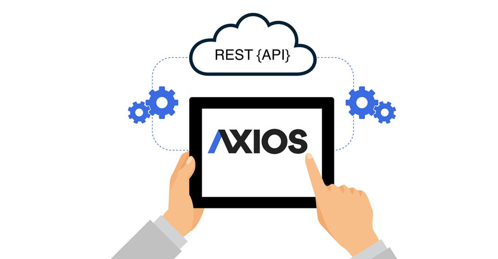

## Axios چیست ؟

axios یک کتابخانه است که با نصب ان در پروژه این امکان را به ما میده تا بتونیم درخواست های 
http خودمون را ارسال کنیم

شاید براتون سوال بشه که چرا از همون fetch جاوااسکریپت استفاده نمیکنیم ؟

مزیت های axios نسبت به fetch این هست که مرورگر های قدیمی را پشتیبانی میکند
و از همه مهمتر interceptor را پشتیبانی میکنه که بعدا باهاش بیشتر اشنا میشیم.

### نحوه نصب axios

برای نصب axios به روت پروژه برید و دستور زیر را اجرا کنید:

```bash
npm i axios
```

### نحوه استفاده از axios

برای مثال فرض کنید ما یک api داریم که لیست کاربر ها را به ما میدهد برای دریافت لیست با axios به روش زیر عمل میکنیم:

```javascript
async function getAllUsers() {
    const response = await axios.get('https://jsonplaceholder.typicode.com/users');
    return response.data;
}
```

:::caution نکته
دقت داشته باشید که axios همیشه یک promise بازگردانی میکنه.
:::

:::tip متد های http 
برای صدا کردن متد های http در axios به روش زیر عمل میکنیم:

```javascript
async function addUser(username, email) {
    const response = await axios.post('https://jsonplaceholder.typicode.com/users', {username, email});
    return response.data;
}
```

```javascript
async function deleteUser(id) {
    const response = await axios.delete(`https://jsonplaceholder.typicode.com/users/${id}`);
    return response.data;
}
```

:::

:::tip مطالعه 
- [Axios](https://axios-http.com/docs/intro)
- [Interceptors](https://axios-http.com/docs/interceptors)
- [Handling Errors](https://axios-http.com/docs/handling_errors)

:::

### نحوه استفاده از axios در ریکت
فرض کنید کامپوننتی داریم که لیست کاربرها را نمایش میدهد :

```javascript
import axios from 'axios';
import { useEffect, useState } from 'react';

async function getAllUsers() {
  const response = await axios.get('https://jsonplaceholder.typicode.com/users');
  return response.data;
}

function App() {
  const [users, setUsers] = useState([]);

  useEffect(() => {
    getAllUsers().then((users) => setUsers(users));
  }, []);

  return (
    <div>
     <table>

      <thead>
        <tr>
          <th>id</th>
          <th>username</th>
          <th>email</th>
        </tr>
      </thead>

      <tbody>
        {users.length > 0 && users.map((user) => {
          return (
            <tr key={user.id}>
              <td>{user.id}</td>
              <td>{user.username}</td>
              <td>{user.email}</td>
            </tr>
          );
        })}
      </tbody>
     </table>
    </div>
  );
}
export default App;
```

نکته :
- صدا کردن axios در useEffect رخ داده است.
- برای هر ردیف در map حتما باید key غیر تکراری تعریف شود

:::tip
 میتنوانید مثال بالا را با useMemo , useCallback بهینه سازی کنید
:::

## Json Serverچیست ؟

تا اینجا ما مجبور بودیم برای داشتن api تست به 
[json placeholder ](https://jsonplaceholder.typicode.com/)
درخواست بزنیم
حالا میتونیم با json server خودمون api تستی بسازیم

نحوه نصب :

```bash
npm i -g json-server
```
:::caution نکته
با نصب json-server به صورت global در همه سیستم شما قابل دسترسی خواهد بود

:::

### نحوه راه اندازی سرور api 
حالا نیاز هست که یک پوشه را به عنوان دیتابیس json-server در نظر بگیریم 

```bash
mkdir ./server
```

حالا یک فایل به اسم db.json درون پوشه میسازیم و محتوای زیر را درون ان میریزیم:

```json
{
  "users": [
    {
      "id": 1,
      "name": "Leanne Graham",
      "username": "Bret",
      "email": "Sincere@april.biz",
      "address": {
        "street": "Kulas Light",
        "suite": "Apt. 556",
        "city": "Gwenborough",
        "zipcode": "92998-3874",
        "geo": {
          "lat": "-37.3159",
          "lng": "81.1496"
        }
      },
      "phone": "1-770-736-8031 x56442",
      "website": "hildegard.org",
      "company": {
        "name": "Romaguera-Crona",
        "catchPhrase": "Multi-layered client-server neural-net",
        "bs": "harness real-time e-markets"
      }
    },
    {
      "id": 2,
      "name": "Ervin Howell",
      "username": "Antonette",
      "email": "Shanna@melissa.tv",
      "address": {
        "street": "Victor Plains",
        "suite": "Suite 879",
        "city": "Wisokyburgh",
        "zipcode": "90566-7771",
        "geo": {
          "lat": "-43.9509",
          "lng": "-34.4618"
        }
      },
      "phone": "010-692-6593 x09125",
      "website": "anastasia.net",
      "company": {
        "name": "Deckow-Crist",
        "catchPhrase": "Proactive didactic contingency",
        "bs": "synergize scalable supply-chains"
      }
    }
  ]
}
```

حالا زمان ان رسیده که اجراش کنیم.دستور زیر را بزنید:

```bash
json-server --watch server/db.json -p 3001
```
بعد از اجرا شدن سرور ترمینال را باز بگذارید تا تغییرات سرور ما اجرا بماند.

حالا در مثال های قبل میتوان ادرس زیر را جا به جا کنیم:

```bash
https://jsonplaceholder.typicode.com/users

====>

http::localhost:3001/users
```

:::tip مظالعه
- [Json Server Doc](https://github.com/typicode/json-server)

:::