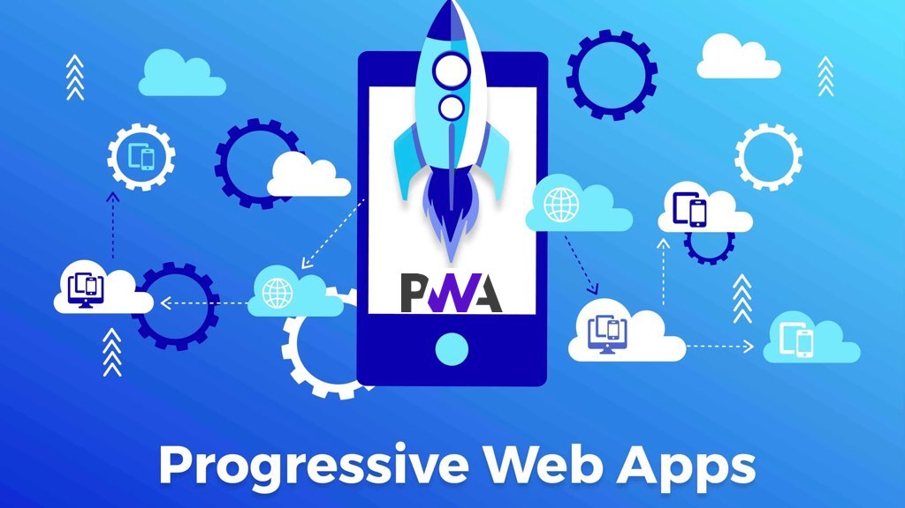
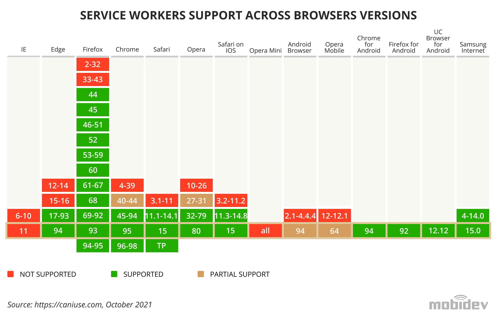

## مقدمه

نوعی برنامه وب است که بهترین ویژگی های برنامه های وب و موبایل را با هم ترکیب می کند. PWA ها برای ارائه یک تجربه کاربری یکپارچه با استفاده از فناوری ها و شیوه های مدرن وب طراحی شده اند. آنها را می توان از طریق یک مرورگر وب مانند وب سایت های معمولی در دسترس قرار داد اما قابلیت های اضافی را ارائه می دهد که با برنامه های تلفن همراه مرتبط است.

## مزایای PWA

### کاهش هزینه های توسعه و Cross-Platform Compatibility

کاهش هزینه‌های توسعه و Cross-Platform Compatibility از ویژگی‌های مهم PWA هستند. PWA‌ها ترکیبی از وب‌سایت‌ها و برنامه‌های نیتیو (Native) هستند و توانمندی‌های بسیاری از برنامه‌های نیتیو را به همراه دارند اما بدون نیاز به نصب از فروشگاه‌های دیجیتال همچنین بدون نیاز به توسعه برنامه برای پلتفرم های مختلف.

### App-Like Experience

به تجربه کاربری ارائه شده توسط PWA اشاره دارد که به طور نزدیکی به تجربه استفاده از یک برنامه موبایل نیتیو شبیه‌سازی می‌شود.

برای این منظور
PWA ها باید روی دستگاه های متفاوت به شکل مناسب اجرا و نمایش داده شوند پس نیاز است که کاملا responsive طراحی شوند. بنابراین در طراحی یک PWA باید به نکات زیر توجه کرد:

-   Flexible Layout
-   Viewport Meta Tag
-   Fluid Typography
-   Orientation Support
-   Device and Feature Detection:‌ برای این کار از کتابخانه های js استفاده می شود که نوع دستگاه و اندازه آن و همچنین feature های آن را استخراج می کنند.

### ویژگی های دیگر

از مزایای دیگر PWA ها می توان به موارد زیر اشاره کرد در در بخش های بعدی به صورت دقیق تر به بررسی آن ها می پردازیم.

-   Push Notifications
-   Offline Support
-   Background Sync

:::tip مطالعه

-   [Progressive Web Apps: Advantages and Disadvantages](https://brainhub.eu/library/progressive-web-apps-advantages-disadvantages)

:::

## Browser Support

از آن جا که مدت زیادی از عمر PWA ها نمی گذرد باید هنگام توسعه یک PWA به پشتیبانی آن توسط مرورگر های مختلف توجه کرد. هر چند که PWA توسط مرورگر های به روز به طور کامل پشتیبانی می شوند ولی برای برخی مرورگر ها باید ملاحظات خاصی را در نظر گرفت. برای مثال، Safari برای حفظ عمر باتری و محافظت از حریم خصوصی کاربر، محدودیت‌های سخت‌تری در پردازش پس‌زمینه دارد.

## Security

این برنامه ها (PWA) برای اطمینان از تجربه کاربری ایمن و قابل اعتماد، امنیت را در اولویت قرار می‌دهند. در اینجا برخی از جنبه های کلیدی امنیت PWA آورده شده است :

1- پروتکل PWA : HTTPS ها برای عملکرد به یک اتصال HTTPS ایمن نیاز دارند.

2- امنیت سرویس ورکر (Service Worker Security) : در تعاملات بین Service Worker و Client باید ملاحظات امنیتی را رعایت کرد که در بخش های بعدی به بررسی آن ها می پردازیم.

به طور کلی در ساخت یک PWA باید نکات امنیتی زیادی را مورد توجه قرار داد. زیرا در صورت نفوذپذیری برنامه ممکن است دچار حملات مختلفی مثل XSS یا CSRF شود.

:::tip مطالعه

-   [How to Protect Your PWA](https://www.freecodecamp.org/news/how-to-protect-your-pwa/)

-   [The top API security risks and how to mitigate them](https://appinventiv.com/blog/how-to-mitigate-api-security-risks/)

:::
