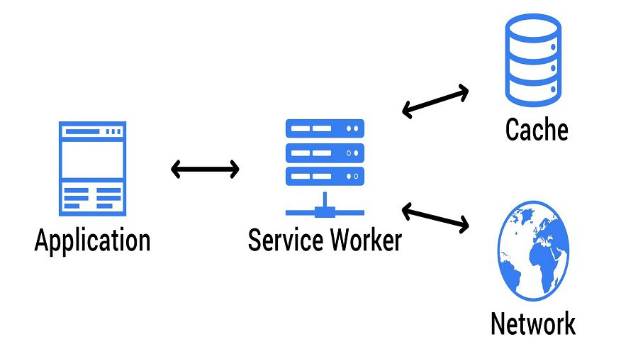

## What is Service Worker

سرویس ورکر اسکریپتی است که در پس‌زمینه یک برنامه وب، جدا از صفحه اصلی وب اجرا می‌شود و به عنوان یک پروکسی بین برنامه وب، مرورگر و شبکه عمل می‌کند. این ویژگی‌های پیشرفته مختلف را برای برنامه‌های وب فعال می‌کند، از جمله دسترسی آفلاین، همگام‌سازی پس‌زمینه، و پوش نوتیفیکیشن ها. سرویس ورکر بخش اساسی معماری برنامه وب پیشرو (PWA) هستند.

در اینجا برخی از ویژگی ها و قابلیت های کلیدی سرویس ورکر ها آورده شده است:

-   پردازش پس‌زمینه (Background Processing)
-   ذخیره سازی ( Caching)
-   دسترسی آفلاین ( Offline Access)
-   Network Intercept
-   پوش نوتیفیکیشن ها (Push Notifications)
-   همگام سازی پس زمینه ( Background Sync)
-   امنیت (Security )
-   چرخه حیات و به روز رسانی ( Lifecycle and Updating)

## Registration

ثبت یک سرویس ورکر شامل این است که به مرورگر بگویید که یک فایل جاوا اسکریپت خاص را با چرخه عمر سرویس ورکر مرتبط کند. این فرآیند ثبت‌نام به سرویس ورکر اجازه می‌دهد تا صفحات وب را در محدوده خود کنترل کند و درخواست‌های شبکه را رهگیری کند و قابلیت ذخیره‌سازی و عملکرد آفلاین را فعال کند. در اینجا نحوه ثبت یک سرویس ورکر توضیح داده شده است :

۱- ایجاد فایل Service Worker: با ایجاد یک فایل جاوا اسکریپت جداگانه برای سرویس ورکر خود شروع کنید. این فایل حاوی منطق ذخیره‌سازی، رهگیری درخواست‌های شبکه و مدیریت event های چرخه حیات سرویس ورکر است.

۲- ثبت نام Service Worker : در فایل اصلی جاوا اسکریپت خود (معمولاً جایی که برنامه خود را راه اندازی می کنید)، می توانید با استفاده از متد ()navigator.serviceWorker.register سرویس ورکر را ثبت کنید.

```javascript
// main.js

if ('serviceWorker' in navigator) {
    navigator.serviceWorker
        .register('/sw.js')
        .then((registration) => {
            console.log('Service Worker registered with scope:', registration.scope);
        })
        .catch((error) => {
            console.error('Service Worker registration failed:', error);
        });
}
```

-   اسکوپ service worker :محدوده یک Service Worker تعیین می کند که چه صفحاتی را می تواند کنترل کند. به طور پیش فرض، scope دایرکتوری است که سرویس ورکر در آن قرار دارد. به عنوان مثال، اگر /sw.js را ثبت کنید، محدوده دایرکتوری روت خواهد بود. شما می توانید صفحات را در آن محدوده و زیر شاخه های آن را کنترل کنید.

-   چرخه حیات سرویس ورکر : پس از ثبت نام، سرویس ورکر یک چرخه حیاتی را طی می‌کند که شامل نصب، فعال‌سازی و fetch کردن event ها می‌شود. می‌توانید این event ها را در اسکریپت Service Worker خود listen کنید و حافظه پنهان و سایر قابلیت‌ها را پیاده‌سازی کنید.

```javascript
//sw.js

self.addEventListener('install', (event) => {
    // Caching logic during installation
});

self.addEventListener('activate', (event) => {
    // Cleanup and cache management after activation
});

self.addEventListener('fetch', (event) => {
    // Network interception and caching strategies
});
```

## Installation

بعد از مرحله ثبت نوبت مرحله نصب است.
هنگامی که سرویس‌ ورکر ثبت شد، مرورگر event نصب را راه‌اندازی می‌کند.

در قطعه کد زیر در مرحله نصب صبر می کنیم تا فایل های مشخص شده کش شوند.

```javascript
// sw.js

self.addEventListener('install', (event) => {
    event.waitUntil(
        caches.open('my-cache').then((cache) => {
            return cache.addAll([
                '/index.html',
                '/styles.css',
                '/app.js',
                // Add more files to cache
            ]);
        })
    );
});
```

## Activation

فعال‌سازی سرویس ورکر مرحله‌ای حیاتی در چرخه حیات یک سرویس ورکر است. هنگامی که یک سرویس ورکر نصب می‌شود، بلافاصله کنترل صفحات و منابع را در دست نمی‌گیرد.

1- ایونت avtivate : هنگامی که یک سرویس‌ ورکر نصب می‌شود و صفحات وب مرتبط با آن بسته می‌شوند یا دوباره بارگیری می‌شوند، مرورگر منتظر می‌ماند تا دیگر صفحه‌ای وجود نداشته باشد که سرویس‌ ورکر آن را کنترل می‌کند. پس از این اتفاق، سرویس‌ ورکر فعال می‌شود و رویداد فعال‌سازی اجرا می‌شود.

2- پاک کردن کش های قدیمی: یکی از کارهای رایج در طول فعال سازی، پاک کردن کش های قدیمی از نسخه های قبلی سرویس ورکر یا برنامه است. می توانید نام های کش را با هم مقایسه کنید و کش هایی را که دیگر مورد نیاز نیستند حذف کنید.

```javascript
// sw.js

self.addEventListener('activate', (event) => {
    event.waitUntil(
        caches.keys().then((cacheNames) => {
            return Promise.all(
                cacheNames.map((cacheName) => {
                    if (cacheName !== 'current-cache') {
                        return caches.delete(cacheName);
                    }
                })
            );
        })
    );
});
```

3- اگر می‌خواهید که سرویس‌ورکر جدید بلافاصله پس از فعال‌سازی کنترل را در دست بگیرد، می‌توانید از روش ()self.skipWaiting استفاده کنید. این می تواند برای اطمینان از اینکه کاربران آخرین نسخه برنامه شما را بدون نیاز به بارگیری مجدد چندین بار دریافت می کنند مفید باشد.

```javascript
// sw.js

self.addEventListener('activate', (event) => {
    event
        .waitUntil
        // Cleanup tasks
        ();
    self.skipWaiting(); // Activate immediately and take control
});
```

4- به طور پیش فرض، سرویس ورکر جدید فقط کلاینت های جدیدی (صفحات وب) را که پس از فعال سازی باز می شوند کنترل کند. برای اینکه سرویس‌ورکر جدید کنترل همه کلاینت‌های باز را به دست بگیرد، می‌توانید از روش self.clients.claim() استفاده کنید.

```javascript
// sw.js

self.addEventListener('activate', (event) => {
  event.waitUntil(
    // Cleanup tasks
    self.clients.claim(); // Take control of all open clients
  );
});
```

## Cashing Strategies

روش های مختلفی برای کش کردن فایل ها در سرویس ورکر ها وجود دارد که در ادامه به بررسی آن ها می پردازیم:

### Cache-First Strategy

در استراتژی Cache-First، سرویس‌ورکر ابتدا بررسی می‌کند که آیا منبع درخواستی در حافظه پنهان موجود است یا خیر. اگر اینطور باشد، نسخه کش ارائه می شود. در غیر این صورت، سرویس‌کار منبع را از شبکه fetch می‌کند و آن را برای استفاده بعدی ذخیره می‌کند.

```javascript
// sw.js

self.addEventListener('fetch', (event) => {
    event.respondWith(
        caches.match(event.request).then((response) => {
            return response || fetch(event.request);
        })
    );
});
```

### Network-First Strategy

در استراتژی Network-First ، سرویس‌ورکر ابتدا سعی می‌کند منبع درخواستی را از شبکه دریافت کند. اگر درخواست شبکه (آفلاین) ناموفق باشد، سرویس‌ورکر محتوا را از حافظه پنهان ارائه می‌کند.

```javascript
//Script (sw.js)
self.addEventListener('fetch', (event) => {
    event.respondWith(
        fetch(event.request)
            .then((response) => {
                // Clone the response to cache it
                const clonedResponse = response.clone();
                caches.open('my-cache').then((cache) => {
                    cache.put(event.request, clonedResponse);
                });
                return response;
            })
            .catch(() => {
                return caches.match(event.request);
            })
    );
});
```

### Cache-Only Strategy

در این استراتژی فقط به کش برای دریافت منابع مراجعه می کنیم و در صورت عدم وجود منابع دیگر آن ها را از شبکه دریافت نخواهیم کرد و نتیجه درخواست ناموفق گزارش داده خواهد شد.

```javascript
self.addEventListener('fetch', (event) => {
    event.respondWith(
        caches.match(event.request).then((response) => {
            return response || new Response('Resource not cached', {status: 404});
        })
    );
});
```

-   ### مزایا
    استراتژی Cache-Only معمولاً برای asset هایی استفاده می شود که انتظار نمی رود به طور مکرر تغییر کنند و می توانند به طور ایمن برای مدت طولانی ذخیره شوند. این رویکرد برای سناریوهایی مناسب است که در آن اتصال به شبکه ضروری نیست
-   ### معایب
    توجه به این نکته مهم است که استفاده از یک استراتژی سختگیرانه Cache-Only می‌تواند منجر به مشکلات احتمالی در هنگام استقرار به‌روزرسانی‌های برنامه شما شود، زیرا سرویس‌ورکر به سرویس‌دهی منابع ذخیره‌شده تا زمانی که حافظه پنهان صریحاً نامعتبر یا پاک شود، ادامه می‌دهد.

### Network-Only Stragegy

در این استراتژی درست برعکس Cache-Only عمل می کنیم و اگر درخواست انجام شده به شبکه ناموفق بود دیگر به بررسی کش نخواهیم پرداخت . نتیجه درخواست ناموفق خواهد بود.

```javascript
self.addEventListener('fetch', (event) => {
    event.respondWith(fetch(event.request));
});
```

-   ### مزایا

    استراتژی Network-Only در سناریوهایی که داده‌های real-time حیاتی هستند مفید است و ذخیره‌سازی حافظه پنهان می‌تواند مانع از ارائه جدیدترین اطلاعات شود.

-   ### معایب

با این حال، توجه به این نکته مهم است که تنها اتکا به استراتژی Network-Only می تواند منجر به افزایش زمان بارگذاری شود، به خصوص اگر اتصال شبکه کند یا غیرقابل اعتماد باشد. این استراتژی ممکن است برای asset هایی که اغلب تغییر نمی‌کنند ایده‌آل نباشد

## Handling Updates & Versioning

مدیریت به‌روزرسانی‌ها و نسخه‌سازی برای Service Worker برای اطمینان از به‌روز ماندن برنامه وب شما و اینکه کاربران آخرین ویژگی‌ها و رفع اشکال‌ها را دریافت می‌کنند، مهم است. همچنین تضمین می کند که منابع ذخیره شده به درستی مدیریت می شوند و کش های قدیمی پاک می شوند. در اینجا نحوه مدیریت به‌روزرسانی‌ها و نسخه‌سازی برای سرویس ورکرها را بررسی می کنیم:

### Versioning the Service Worker

1- هنگامی که برای اولین بار یک سرویس ورکر ایجاد می کنید، یک شماره نسخه به آن بدهید. این شماره نسخه باید هر بار که تغییراتی در اسکریپت Service Worker یا منابع ذخیره شده در حافظه پنهان ایجاد می کنید به روز شود.

```javascript
const CACHE_VERSION = 'v1';
```

2- هر زمان که تغییراتی در اسکریپت Service Worker ایجاد می کنید، باید شماره نسخه موجود در فایل را نیز به روز کنید.

### Handling Updates

1- هنگامی که نسخه جدیدی از سرویس ورکر ثبت می شود، مرورگر رویداد "نصب" را فعال می کند. این فرصت خوبی برای ذخیره منابع جدید یا به روز شده است.

```javascript
self.addEventListener('install', (event) => {
    event.waitUntil(
        caches.open(CACHE_VERSION).then((cache) => {
            return cache.addAll([
                '/index.html',
                '/styles.css',
                '/app.js',
                // Add new or updated resources
            ]);
        })
    );
});
```

2- پس از نصب یک سرویس ورکر جدید، مرورگر رویداد "فعال سازی" را فعال می کند. این مکان مناسبی برای پاکسازی کش های قدیمی از نسخه های قبلی است.

```javascript
self.addEventListener('activate', (event) => {
    event.waitUntil(
        caches.keys().then((cacheNames) => {
            return Promise.all(
                cacheNames.map((cacheName) => {
                    if (cacheName !== CACHE_VERSION) {
                        return caches.delete(cacheName);
                    }
                })
            );
        })
    );
});
```

### Update Prompt

1- می توانید یک درخواست به روز رسانی را برای کاربران پیاده سازی کنید تا آنها را از در دسترس بودن نسخه جدید برنامه مطلع کنند. به رویداد message از listen ، clinet کنید تا این درخواست را فعال کنید.

```javascript
self.addEventListener('message', (event) => {
    if (event.data === 'skipWaiting') {
        self.skipWaiting();
    }
});
```

2- در کد کلاینت خود (جاوا اسکریپت در صفحات وب شما اجرا می شود)، می توانید یک "پیام" به سرویس ورکر ارسال کنید تا از آن بخواهد به روز رسانی شود.

```javascript
if (navigator.serviceWorker.controller) {
    navigator.serviceWorker.controller.postMessage('skipWaiting');
}
```

با دنبال کردن این مراحل، می‌توانید اطمینان حاصل کنید که سرویس‌ورکر شما هنگام انتشار نسخه‌های جدید برنامه وب خود، به‌درستی به‌روزرسانی می‌شود. این کمک می کند تا برنامه شما قابل اعتماد، ایمن و به روز نگه داشته شود

:::tip مطالعه

-   [Five service worker caching strategies](https://www.educative.io/answers/5-service-worker-caching-strategies-for-your-next-pwa-app)

-   [Handling service worker updates with immediacy](https://developer.chrome.com/docs/workbox/handling-service-worker-updates/)

:::
