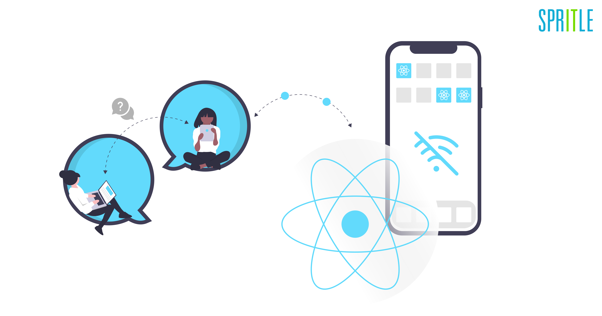

## مقدمه
در این بخش به بررسی نحوه انتقال پیام از clinet به service worker و برعکس می پردازیم. همچنین ۳ ویژگی مهم که service workers در اختیار ما قرار می دهند را بررسی می کنیم که عبارتند از:
- Offline Support
- Background Sync
- Push Notification

## انتقال پیام
انتفال پیام (Message Passing) اجازه می‌دهد تا نخ اصلی و  Service Worker به صورت بی‌درنگ داده‌ها و دستورالعمل‌ها را تبادل کنند. این کانال ارتباطی به نخ اصلی امکان می‌دهد تا وظایف مختلفی را در کارگر پس‌زمینه (Background Worker) فعال کند و برعکس.


### Post Message API
برای تبادل پیام بین Service Worker و نخ اصلی از Post Message API استفاده می شود.

در قطعه کد زیر پیام FetchData را برای service worker ارسال می کنیم تا جلو تر از آن استفاده کنیم.
```javascript
// Main thread sends messages to service worker

if ('serviceWorker' in navigator) {
  navigator.serviceWorker.ready.then((registration) => {
    registration.active.postMessage("FetchData");
  }).catch(error => {
    console.log("Error accessing service worker", error);
  });
}

```
حالا پیام را دریافت کرده و با همان  postMessage جواب را به client  ارسال می کنیم.


```javascript
// Get message from client and send back the answer

self.addEventListener('message', (event) => {
  const messageFromMainThread = event.data;

  if (messageFromMainThread === 'FetchData') {
    // Perform a fetch operation and send back the response to the main thread
    fetch('https://api.example.com/data')
      .then((response) => response.json())
      .then((data) => {
        // Send the data back to the main thread

        // Method 1:
        // self.clients.get(event.source.id).then((client) => {
        //   client.postMessage(data);
        // });

        // Method 2:
        event.source.postMessage(data);
      });
  }
});

```

### امنیت
  به‌طور کلی postMessage به عنوان یک مکانیزم بسیار امن در نظر گرفته می‌شود، تا زمانی که برنامه‌نویس با دقت بررسی کند که منبع و اصل پیامی که در حال رسیدن است مورد اطمینان است یا خیر. عمل به یک پیام بدون تأیید مبدأ آن، راهی برای حملات   Cross-Site Scripting باز می‌کند و می تواند باعث مشکلات امنیتی دیگری نیز شود.

 برای تعیین مبدأ به شکل زیر عمل می کنیم:

```javascript
//service worker

self.addEventListener('message', event => {
  // Check the origin of the incoming message
  const trustedOrigins = ['https://www.example.com', 'https://subdomain.example.com'];
  if (!trustedOrigins.includes(event.origin)) {
    // Message is from an untrusted origin, ignore it
    return;
  }

  // Sanitize and process the message from the trusted origin
  const sanitizedMessage = sanitizeContent(event.data);
  // ... Your code to handle the sanitized message ...
});
```

در آخر وقتی از مبدأ پیام اطمینان حاصل کردیم آن را sanitize می کنیم تا از امنیت آن اطمینان حاصل کنیم.

```javascript
function sanitizeContent(content) {
  // You can use a library like DOMPurify to sanitize HTML content
  // Be careful not to remove necessary elements or attributes
  // For this example, we will use a simple escape function
  return escapeHTML(content);
}

function escapeHTML(unsafeString) {
  return unsafeString.replace(/</g, '&lt;').replace(/>/g, '&gt;');
}
```

:::tip  مطالعه
- [Post Message MDN](https://developer.mozilla.org/en-US/docs/Web/API/Window/postMessage)
- [Post Message Security Checklist](https://gist.github.com/jedp/3005816#checklist-for-postmessage-security-review)
- [Sanitizer API MDN](https://developer.mozilla.org/en-US/docs/Web/API/HTML_Sanitizer_API)
- [What is Sanitization](https://blog.logrocket.com/what-you-need-know-inbuilt-browser-html-sanitization/)

:::


## پشتیبانی آفلاین (Offline Support)
برای بهبود تجربه کاربری آفلاین، توسعه‌دهندگان می‌توانند صفحات یا قالب‌های آفلاین خاصی را طراحی کنند. این صفحات می‌توانند پیام یا رابط کاربری سفارشی نمایش دهند و به کاربران اطلاع دهند که در حالت آفلاین هستند و آن‌ها را راهنمایی کنند که در حالت آفلاین چه کارهایی انجام دهند.

به عنوان مثال در قطعه کد زیر ابتدا بررسی می کنیم که آیا داده های مورد نیاز در کش موجود هستند یا خیر. اگر وجود نداشتند سعی می کنیم آن ها را از طریق network   دریافت  کنیم و به کش اضافه کنیم و اگر این هم نشد از offline.html استفاده می کنیم. 

```javascript
// service-worker.js
self.addEventListener('fetch', (event) => {
  event.respondWith(
    caches.match(event.request)
      .then((response) => {
        // Serve the cached resource if available
        if (response) {
          return response;
        }

        // Fetch the resource from the network and add it to the cache
        return fetch(event.request)
          .then((response) => {
            const clonedResponse = response.clone();
            caches.open("my-cache")
              .then((cache) => {
                cache.put(event.request, clonedResponse);
              });
            return response;
          })
          .catch((error) => {
            // If offline and the resource is not in cache, show the offline page
            if (event.request.mode === 'navigate') {
              return caches.match('/offline.html');
            }
          });
      })
  );
});
```


:::caution توجه

در قطعه کد بالا فرض بر این است که فایل offline.html در مرحله نصب به کش اضافه شده است.

:::


## همگام سازی پس زمینه (Background Sync)  
همگام‌سازی پس‌ زمینه  به برنامه‌های وب اجازه می‌دهد داده‌ها را با سرور  همگام‌سازی کنند، حتی زمانی که برنامه آفلاین است یا اتصال محدودیت دارد. این ویژگی تضمین می‌کند که تعاملات کاربر و داده‌ها به دلیل اختلالات شبکه از دست نرفته و تجربه کاربری بهبود می‌یابد.

```javascript
const handleSync = () => {
    if ('serviceWorker' in navigator && 'SyncManager' in window) {
      navigator.serviceWorker.ready.then(registration => {
        return registration.sync.register('data-sync')
          .then(() => {
            // Data will be synced in the background when the user has a stable internet connection
            console.log('Data registered for background sync.');
          })
          .catch(error => {
            // Registration failed
            console.error('Background sync registration failed:', error);
          });
      });
    } else {
      // Background sync is not supported
      console.log('Background sync is not supported in this browser.');
    }
  };
```
حالا می توان با استفاده از تگ data-sync برای service worker یک تسک تعریف کرد

```javascript
self.addEventListener('sync', event => {
  if (event.tag === 'data-sync') {
     // handleDataSync function will be called when the user has a stable internet connection
    // You can perform the necessary actions to sync your data
    event.waitUntil(handleDataSync());
  }
});
```

:::tip مطالعه 

[Background Sync API MDN](https://developer.mozilla.org/en-US/docs/Web/API/Background_Synchronization_API)

[SyncManager MDN](https://developer.mozilla.org/en-US/docs/Web/API/SyncManager)

:::

## پوش نوتیفیکیشن (Push Notification) 

### Permission
برای ارسال اعلان بعد از بررسی اینکه مرور گر  از ارسال اعلان پشتیبانی می کند از کاربر می خواهیم که اجازه ارسال اعلان را صادر کند.

```javascript
useEffect(() => {
    // Request permission for notifications
    if ('Notification' in window) {
      Notification.requestPermission().then(permission => {
        if (permission === 'granted') {
          console.log('Notification permission granted.');
          subscribeUserToPush();
        } else {
          console.log('Notification permission denied.');
        }
      });
    }
  }, []);
```

### Subscription
سپس اطلاعات مربوط به subscription را دریافت و به سرور ارسال می کنیم.

```javascript
 const subscribeUserToPush = async () => {
    try {
      const registration = await navigator.serviceWorker.ready;
      const subscription = await registration.pushManager.subscribe({
        userVisibleOnly: true,
        applicationServerKey: 'YOUR_PUBLIC_VAPID_KEY',
      });

      // Send the subscription details to your server
      sendSubscriptionToServer(subscription);
    } catch (error) {
      console.error('Error subscribing to push notifications:', error);
    }
  };

  const sendSubscriptionToServer = (subscription) => {
    // Send the subscription details to your server using fetch or any other method
  };
```

و در نهایت برای ارسال اعلان داریم:

### Push
```javascript
// serviceWorker

self.addEventListener('push', event => {
  if (event.data) {
    const notificationData = event.data.json();
    const options = {
      body: notificationData.body,
      icon: '/path/to/icon.png', // Replace with the path to your app's icon
    };
    event.waitUntil(self.registration.showNotification(notificationData.title, options));
  }
});

```

:::tip مطالعه

[Using Push Notification MDN](https://developer.mozilla.org/en-US/docs/Web/Progressive_web_apps/Tutorials/js13kGames/Re-engageable_Notifications_Push)

:::