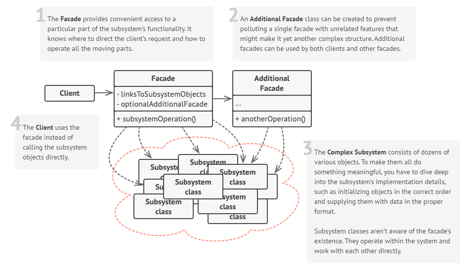

# Design Patterns

الگوهای طراحی یا Design Patterns قواعد یا دستور العملی هایی هستند که در طی زمان برای بهبود برنامه نویسی و توسعه نرم افزار توسط توسعه دهندگان رواج پیدا کرد. در واقع الگوهای طراحی به ما میگویند برای حل یک مشکل مشخص چه روشی وجود دارد که این مشکلات معمولا فارغ از زبان یا تکنولوژی مورد استفاده ما هستند.
به طور کلی الگوی های طراحی به 3 دسته تقسیم میشوند:

-   Creational
-   Structural
-   Behavioral

# Creational

این دسته شامل مکانیسم ها و دستورات مشخص برای ساخت و گسترش کلاس ها و اشیاء مختلف میشوند که میتواند منجر به کاهش کد و قابل استفاده شدن کد ما کمک کند.

برای آشنایی با این دسته از الگو های طراحی میتوانید به این لینک مراجعه کنید

-   [Creational Design Patterns ](https://refactoring.guru/design-patterns/creational-patterns)

# Structural

الگوهای structural به منظور مدیریت ارتباط بین کلاس ها و اشیاء مختلف میشوند
در واقع این الگوها دستور العملی برای گرد هم آوردن کلاس های مختلف را ارائه میکنند که با استفاده
آن ها میتوان کلاس های مختلف را در یک مقیاس برزگتر در کنار هم مدیریت کرد.

برای آشنایی با این دسته از الگو های طراحی میتوانید به این لینک مراجعه کنید

-   [Structural Design Patterns ](https://refactoring.guru/design-patterns/structural-patterns)

# Behavioral

آخرین دسته از الگوهای طراحی به رفتار و مسئولیت های هر کلاس می پردازد و مشخص میکند چگونه باید مسئولیت ها تقسیم شوند و وظایف هر کلاس چیست و وظایف چگونه باید مدیریت شود.

برای آشنایی با این دسته از الگو های طراحی میتوانید به این لینک مراجعه کنید

-   [Behavioral Design Patterns ](https://refactoring.guru/design-patterns/behavioral-patterns)

در این مطلب به الگوی طراحی Facade میپردازیم و نحوه پیاده سازی آن در react را بیان میکنیم.

# Facade Design Pattern

فساد (facade) یک الگوی طراحی structural است. این الگوی طراحی نقش یک رابط را بین یک کلاس پیچیده و یک کلاس با سطح کد بالاتر را ایفا میکند.
به نحوی که ارتباط این دو کلاس از طریق فساد ایجاد میشود. به مثال زیر توجه کنید:
زمانی که شما به رستورانی میروید از طریق پیشخوان فقط سفارش خود را ثبت میکنید و تمام دستورات
لازم توسط مسئول پیش خوان به باقی بخش ها داده میشود و شما دیگر نیاز با انجام کاری ندارید.


تمرکز ما در این مطلب به پیاده سازی این الگوی طراحی در React است معمولا الگوی طراحی facade با استفاده از Custom Hooks در ری اکت پیاده سازی میشود .
به نمونه کد زیر توجه کنید

```jsx
import React, {useEffect, useRef, useState} from 'react';
export default function BigSlider({mainbody, imgData}) {
    const Values = useRef({
        //needed values
    });
    const items = useRef(null);
    const [left, setLeft] = useState(0);
    const [index, setIndex] = useState(0);
    useEffect(() => {
        // necessary logic
    }, []);

    function HandleEventmove(event) {
        // Handle Event over
    }
    function getPosition(event) {
        // return the event position
    }
    function HandleEventDown(e) {
        // Handle Event down
    }
    function HandleEventUp(e) {
        // Handle Event Up
    }
    function shifttheAnimation(dir) {
        // set the animation for transmition
    }

    function HandleTransitionEnd(e) {
        // remove animation
    }
    return (
        <div
            id="bigslider"
            className=" ltr big-slider w-[100%] h-[300px] flex mb-[65px] vsmmobile:mb-0 vsmmobile:h-[40%]"
        >
            <div className="overflow-hidden relative h-[100%] my-[20px]">
                <div
                    onMouseMove={HandleEventmove}
                    onTouchMove={HandleEventmove}
                    onMouseUp={HandleEventUp}
                    onTouchEnd={HandleEventUp}
                    onTouchStart={HandleEventDown}
                    onMouseDown={HandleEventDown}
                    onTransitionEnd={HandleTransitionEnd}
                    ref={items}
                    className={`items w-[300%] h-[100%] ${
                        Values.current.animation ? 'transition-[left] ease-out duration-200' : ''
                    } relative top-0 flex gap-3 vsmmobile:gap-[2rem] vsmmobile:h-[85%]`}
                    style={{left: `${left}px`}}
                >
                    <div className="bigslide cursor-pointer float-left justify-center transition-all duration-100 relative">
                        
                    </div>
                    <div className="bigslide  cursor-pointer float-left  justify-center transition-all duration-100 relative">
                        
                    </div>
                    <div className="bigslide cursor-pointer float-left justify-center transition-all duration-100 relative">
                        
                    </div>
                </div>
            </div>
        </div>
    );
}
```

این کد به منظور ساخت یک اسلایدر در ری اکت ساخته شده است که تمام محاسبات در کد سطح بالا در معرض نمایش گذاشته شده است برای بهبود این وضعیت از فساد استفاده میکنیم و یک هوک کاستوم میسازیم و کد را به این شکل تغییر میدهیم

# UseBigSlider hook

```jsx
import React, {useEffect, useState, useRef} from 'react';
export default function useBigSlier(mainbody, imgData) {
    const [left, setLeft] = useState(0);
    const [index, setIndex] = useState(0);
    const Values = useRef({
        //needed values
    });
    const items = useRef(null);
    const [left, setLeft] = useState(0);
    const [index, setIndex] = useState(0);
    useEffect(() => {
        // necessary logic
    }, []);

    function HandleEventmove(event) {
        // Handle Event over
    }
    function getPosition(event) {
        // return the event position
    }
    function HandleEventDown(e) {
        // Handle Event down
    }
    function HandleEventUp(e) {
        // Handle Event Up
    }
    function shifttheAnimation(dir) {
        // set the animation for transmition
    }

    function HandleTransitionEnd(e) {
        // remove animation
    }

    return [HandleEventmove, Values, HandleTransitionEnd, HandleEventUp, HandleEventDown, index, left];
}
```

# BigSlider Component

```jsx
import React, {useEffect} from 'react';
import useBigSlier from '../../utility/useBigSlier';
export default function BigSlider({mainbody, imgData}) {
const [HandleEventmove, Values, HandleTransitionEnd, HandleEventUp, HandleEventDown, index,left]= useBigSlier( mainbody,imgData);
    return (
        <div
            id="bigslider"
            className=" ltr big-slider w-[100%] h-[300px] flex mb-[65px] vsmmobile:mb-0 vsmmobile:h-[40%]"
        >
            <div className="overflow-hidden relative h-[100%] my-[20px]">
                <div
                    onMouseMove={HandleEventmove}
                    onTouchMove={HandleEventmove}
                    onMouseUp={HandleEventUp}
                    onTouchEnd={HandleEventUp}
                    onTouchStart={HandleEventDown}
                    onMouseDown={HandleEventDown}
                    onTransitionEnd={HandleTransitionEnd}
                    className={`items w-[300%] h-[100%] ${
                        Values.current.animation ? 'transition-[left] ease-out duration-200' : ''
                    } relative top-0 flex gap-3 vsmmobile:gap-[2rem] vsmmobile:h-[85%]`}
                    style={{left: `${left}px`}}
                >
                    <div className="bigslide cursor-pointer float-left justify-center transition-all duration-100 relative">
                        
                    </div>
                    <div className="bigslide  cursor-pointer float-left  justify-center transition-all duration-100 relative">
                        
                    </div>
                    <div className="bigslide cursor-pointer float-left justify-center transition-all duration-100 relative">
                        
                    </div>
                </div>
            </div>
        </div>
    );
}
```

همانطور که مشاهده میکنید کد تغییر یافته به صورت منظم تر و ساده تر از کد اولی است که قابلیت بهبود بیشتری هم دارد.
برای آشنایی بیشتر با الگوی طراحی فساد میتوانید به لینک زیر مراجعه کنید
- [Facade](https://refactoring.guru/design-patterns/facade)