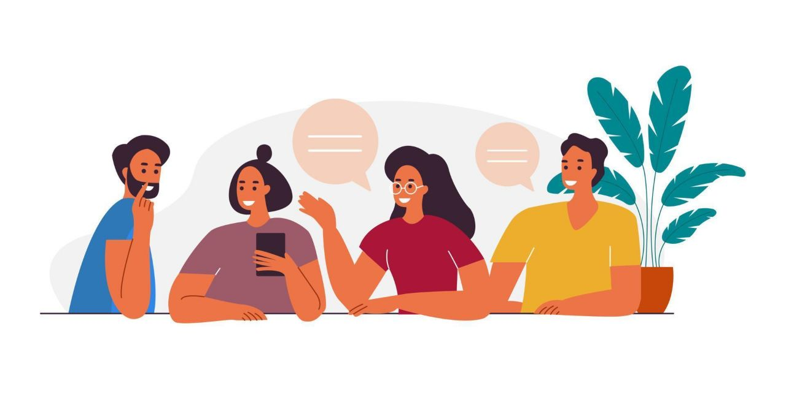

# انواع جلسات توی بوت‌کمپ

در طول دوره یه سری جلسات داریم که خوبه از همین الان باهاشون آشنا بشیم.
از مهمترینشون شروع کنیم، جلسه‌ روزانه!

## جلسه روزانه

همونطور که از اسمش پیداست، جلسه‌ایه که هر روز برگزار می‌شه. توی این جلسه به بررسی پیشرفت اون روز، چالش‌هاش، نکات مهم و غیره و همچنین برنامه‌مون برای ادامه مسیر می‌پردازیم.
این جلسات، هر روز ساعت ۴ و نیم الی حداکثر ۵ برگزار میشه و شما می‌تونین دغدغه‌هاتون رو مطرح کنین.

:::info
دقت کنید که حضور توی این جلسه خیلی مهمه و توی پیشرفتتون در ابعاد فنی و غیر فنی موثره. برای همین غیبت توی این جلسه مجاز نیست و امتیاز منفی داره.
:::

## جلسات یک‌به‌یک
تو این جلسه که به صورت فردی برگزار می‌شه، شما با راهبرتون درباره پیشرفت‌ها، مشکلات، مسیر رشد و … خودتون صحبت می‌کنید. اگر انتقاد و پیشنهادی هم درباره کارآموزی داشتین تو این جلسات خیلی راحت مطرح کنین. در [اینجا](https://virgool.io/@hamgam/%D8%A7%D9%87%D9%85%DB%8C%D8%AA-%D9%88-%D9%85%D8%B2%D8%A7%DB%8C%D8%A7%DB%8C-%D8%AC%D9%84%D8%B3%D8%A7%D8%AA-%DB%B1%DB%B1-dfq1ml8yrovh) می‌توانید درباره این جلسات بیشتر بخوانید.

## جلسات AMA 😎

جلسه AMA یا همون Ask Me Anything یک سری جلساته که توی اون شما با راهبرتون یا یک سری افراد با تجربه در شرکت یک جلسه میذارید و هرچی که دلت می‌خواد در مورد دوره، رشد، و خلاصه هرچیزی که دوست داری می‌پرسی و درموردش صحبت می‌کنی.

[این لینک هم برای اطلاعات بیشتر مطالعه کن](https://worldofwork.io/2019/07/ask-me-anything-sessions/)
