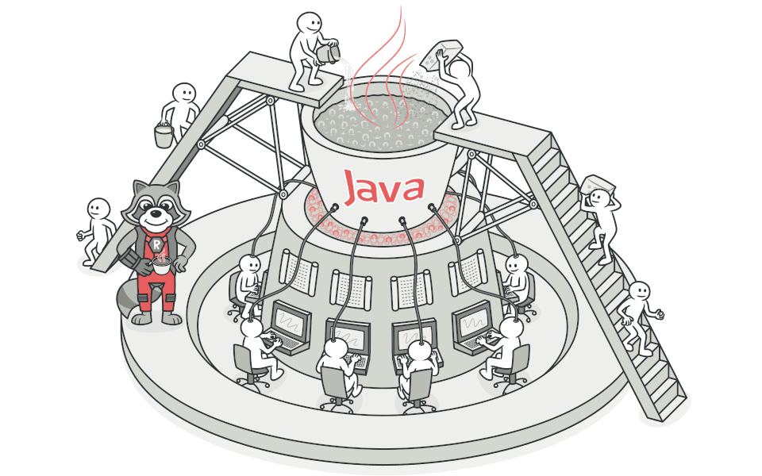

## مقدمه

در این فاز می‌خواهیم به سراغ مفاهیم عمیق‌تر در مهندسی نرم‌افزار و همچنین مباحث پیشرفته در زبان جاوا برویم.

## نام‌گذاری‌ها در Java

یکی از گام‌های مهم یادگیری هر زبان برنامه‌نویسی یادگیری اصول نام‌گذاری آن می‌باشد. شاید نام‌گذاری در وهله اول مورد مهمی به نظر نرسد اما این موضوع از جهتی اهمیت دارد که نباید کد شما نسبت به کدهای جامعه برنامه نویسان آن زبان تافته جدا بافته باشد. برای آشنایی با این قواعد صفحات زیر را مطالعه کنید:

* [Oreillly](https://www.oreilly.com/library/view/java-8-pocket/9781491901083/ch01.html)
* [GeeksForGeeks](https://www.geeksforgeeks.org/java-naming-conventions/)


## Stream

فرض کنید می‌خواهیم در لیست زیر، نام افرادی که نامشان با a (بدون حساسیت به بزرگ‌ یا کوچک بودن حروف) شروع می‌شود را به صورت مرتب شده در خروجی چاپ کنیم:

```java
List myList = Arrays.asList( "Ashkboos aval", “arash kamangir”, “Ashkboos panjom”, “ario Barzan”, “Leily”, "Majnoon", "bahram Goooor", "Amene");
```

احتمالا برای این کار از حلقه استفاده می‌کنیم. روی هر المان حرکت می‌کنیم، آن را به صورت lowercase یا uppercase در می‌آوریم، شروع‌شدنش با a (یا A) را چک می‌کنیم و اگر شرط برقرار بود آن را در لیست دیگری که تعریف کرده‌ایم قرار می‌دهیم. در نهایت هم sort اش می‌کنیم: (تقریبا سودوکد این فرایند به صورت زیر می‌شود)

```java
        List<String> result = new ArrayList<>();

        for (String name : myList)
            if (name.toUpperCase().startsWith("A"))
                result.add(name);

        result.sort(null);

        for (String name : result)
            System.out.println(name);
```

### خبر خوب!

از جاوای ۸ به بعد، امکانی با عنوان Stream API به این زبان اضافه شده است تا کار با مجموعه‌ها (collection) ها را سریع‌تر و ساده‌تر کند. استریم‌ها به ما این امکان را می‌دهند که بتوانیم روی مجموعه‌ای از داده‌ها عملیات‌های مختلفی از جمله filter، جمع، میانگین‌گیری، تبدیل کردن به یک شیء دیگر و … را انجام دهیم.

برای استفاده از آن‌ها کافیست ابتدا مجموعه‌ای که داریم را به شی از نوع Stream تبدیل کنیم.  با این کار می‌توانیم از عملگر‌های میانی (intermediate) و در نهایت از عملگر‌های پایانی (terminal) برای تحویل داده استفاده کنیم.
برای یادگیری نحوه ساختن Stream از مجموعه دادگان، [این لینک](https://www.geeksforgeeks.org/10-ways-to-create-a-stream-in-java/) را مطالعه کنید.

همچنین برای آشنایی بیشتر با Stream ها و عملگر‌های آن، مطالعه [این لینک](https://stackify.com/streams-guide-java-8/) توصیه می‌شود.
حال برای درک تفاوت و چگونگی استفاده از استریم، مسئله‌ای که در ابتدا بیان کردیم را با استفاده از استریم‌ بازنویسی کنید و پاسخ را در ایشوی خود بنویسید.

:::tip
یکی از الگوهای جالب در مهندسی نرم‌افزار که معمولا در طراحی API ها به کار می‌روند، [Fluent API](https://java-design-patterns.com/patterns/fluentinterface/#explanation) است. در ادامه مسیر مهندسی نرم‌افزار (حتی در همین فاز) یکی از کاربردهای این الگو‌ را خواهید دید و همچنین در صورت تمایل می‌توانید از آن در طراحی موتور جستجویتان ایده بگیرید.
:::

## Lambda

اگر چرخی در دنیای برنامه‌نویسی زده باشید احتمالا نام توابع lambda به گوشتان خورده است. در واقع نام دیگر آنها توابع ناشناس است. توابعی که نام ندارند و معمولا برای کار‌های خاص و بسیار کوتاه‌مدت استفاده می‌شوند. در [اینجا](https://www.w3schools.com/java/java_lambda.asp) می‌توانید با این توابع آشنا شوید.

:::info
در این باره می‌توانید نگاهی به تاریخچه توابع لامبدا که از ریاضیات نشأت گرفته است بیندازید. قسمت motivation از [این مقاله](https://en.wikipedia.org/wiki/Lambda_calculus#Motivation) را مطالعه کنید.

:::


## Method Reference

یکی از عملگرهای جالب برای فراخوانی توابع در زبان جاوا عملگر دو نقطه :: است که می‌تواند سبب کوتاه‌ شدن و افزایش خوانایی کد بشود. در [اینجا](https://www.baeldung.com/java-method-references) می‌توانید با این عملگر آشنا شوید و نحوه استفاده از آن را بیاموزید.

برای مثال، در تکه کد زیر می‌توانید نمونه‌ کاربرد لامبدا و همچنین عملگر :: را ببینید:

```java
myList.stream().map(String::toUpperCase).map(String::trim).filter(s -> s.startsWith("A"))
.sorted().forEach(System.out::println);
```

## Maven

توسعه‌دهندگان برای اشتراک گذاشتن و دریافت کدهای به اشتراک گذاشته شده از ابزارهایی تحت عنوان Package Manager استفاده می‌‌کنند. یکی از معروف‌ترین و بهترین این ابزار‌ها Maven است که اولین بار در پروژه توربین جاکارتا برای ساده سازی فرایندهای ساخت استفاده شد. واژه Maven به معنای «جمع‌کننده دانش» است. موارد زیر، از اهداف تولید این ابزار است:

* یک روش استاندارد برای ساخت پروژه ها
* یک تعریف مشخص از اجزای تشکیل دهنده‌ی پروژه
* یک روش آسان برای انتشار اطلاعات پروژه
* یک راه برای به اشتراک گذاشتن JAR ها در چندین پروژه

در کل می‌توان گفت که Maven باعث شده که کار روزمره توسعه دهندگان جاوا آسان‌تر شود و به توسعه پروژه‌های مبتنی بر جاوا کمک زیادی کرده است.

این ابزار، مکانیزم‌هایی برای ایجاد، نگهداری و استفاده از کدها ارائه می‌دهد که برای هر کدام از این مکانیزم‌ها ابزارهایی نیز فراهم کرده است. هنگام استفاده از Maven
توسعه‌دهنده نگران دریافت و اشتراک کدها نمی‌باشد چرا که خود Maven
این عملیات‌ها را مدیریت می‌کند. در نتیجه می‌توان گفت که کار روزمره توسعه‌دهندگان جاوا را آسان‌تر کرده و تولید پروژه‌های بزرگتر را تسریع بخشیده است.

برای شروع به کار میتوانید به [Maven in 5 Minutes](https://maven.apache.org/guides/getting-started/maven-in-five-minutes.html) مراجعه کنید.
سپس مستند [Maven Getting Started Guide](https://maven.apache.org/guides/getting-started/index.html) را بخوانید و به لیست دستورات زیر تسلط پیدا  کنید:
(لازم است توضیح کوتاهی درباره عملکرد هر یک در ایشو بدهید.)

* validate
* compile
* test
* package
* install
* deploy

## لومبوک
لومبوک یک کتابخانه جاوا است که به طور خودکار به ویرایشگر شما متصل می شود و ابزارهایی را ایجاد می کند که شما را از کدهای تکراری و خسته کننده نجات می‌دهد.

شما با استفاده از این کتابخانه سرعت کدنویسی خود را چندبرابر می‌کنید بدون آنکه کیفیت کد شما پایین بیاید . در ضمن لومبوک به شما کمک می‌کند که با حذف Boilerplate Code خوانایی کد خود را بالاتر ببرید.

برای آشنایی بیشتر با لمبوک می‌توانید به [این لینک](https://javacup.ir/introduction-to-lombok/) مراجعه نمایید

:::caution
توجه کنید که کتابخانه lombok بسیار گسترده است و امکانات بسیار متعددی دارد. به طور کلی اما موارد زیر را لازم است حتما بیاموزیم. (به طور سطحی و بدور از پیچیدگی‌ها و قابلیت‌های جزیی‌ای که دارند)

* @Setter
* @Getter
* @Builder
* @RequiredArgsConstructor and other constructor-related ones
* @ToString
:::

:::tip
یکی از انواع الگو‌های طراحی که در ساخت اشیا کاربرد دارد، الگوی Builder است. در این باره می‌توانید [اینجا](https://refactoring.guru/design-patterns/builder) مطالعه کنید.

خوب است شیوه [پیاده‌سازی این الگو در زبان جاوا](https://www.baeldung.com/java-builder-pattern) , و استفاده از کتابخانه لومبوک را مطالعه کنید.
:::

## مطالعه بیشتر:
فصل دوم و سوم از کتاب clean code را مطالعه کنید. همچنین می‌توانید از ویدیو‌های uncle bob به جای مطالعه متن کتاب‌ها استفاده کنید.
