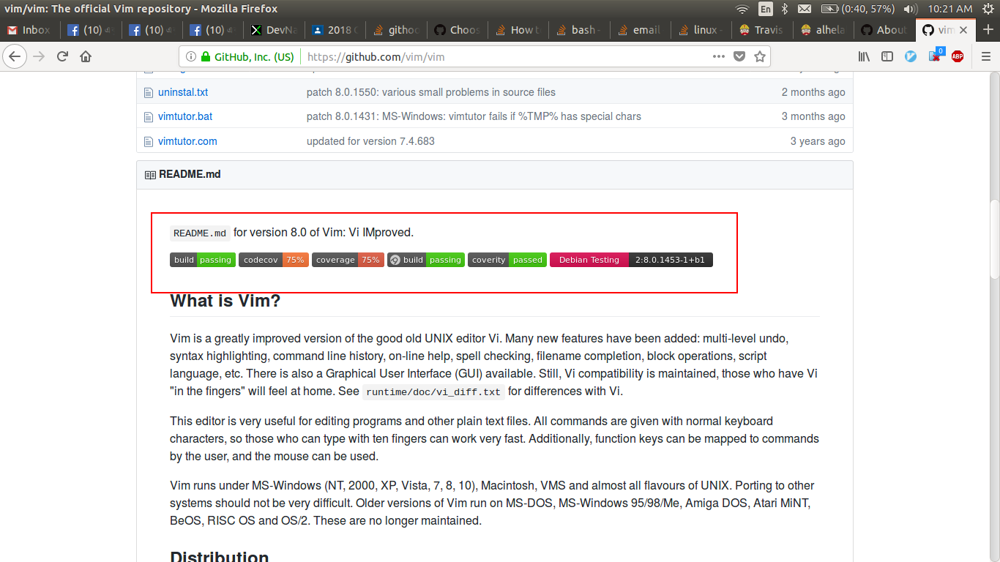

## مقدمه

در این فاز با مفهوم CI/CD
و اهمیت استفاده از آن آشنا می‌شوید و سپس پروژهٔ خود را به CI/CD
مجهز می‌کنید.

## CI/CD چیست و چرا اهمیت دارد

برای درک مفهوم CI/CD
و اهمیت آن لینک‌های زیر را مطالعه کنید.

- [What is CI/CD?(redhat)](https://www.redhat.com/en/topics/devops/what-is-ci-cd)
- [The Journey to CI/CD](https://medium.com/driven-by-code/the-journey-to-ci-cd-b1872927c36b)

## GitHub Actions

یکی از ابزارهای CI/CD معروف، GitHub Actions است که به کمک آن، می‌توانیم یک Pipeline شامل عملیات build، اجرای unit testها، انتشار package و دیگر عملیاتی که در دستهٔ CI/CD می‌گنجد را به Repository خود اضافه کنیم.
برای آشنایی و ساخت یک نمونه pipeline، [این مستند](https://docs.github.com/en/actions/quickstart) را مطالعه کنید.

حال که با مفهوم کلی CI/CD و همچنین github actions آشنا شدید، می‌خواهیم یک pipeline برای ریپازیتوری موتور جست‌وجو بسازیم. برای این کار، در زبان جاوا، [این مستند](https://docs.github.com/en/actions/automating-builds-and-tests/building-and-testing-java-with-maven) را مطالعه کنید.

## badges

احتمالا تا به حال در گیت‌هاب با ریپو‌هایی مواجه شده‌اید که دارای اطلاعات جالبی در ابتدای فایل readme خود بوده‌اند. به این باکس‌های کوچک، به اصطلاح badge گفته می‌شود.
شما نیز با کمک [این لینک](https://docs.github.com/en/actions/monitoring-and-troubleshooting-workflows/adding-a-workflow-status-badge)، به پروژه خود یک badge اضافه کنید. 

## اختیاری
همچنین می‌توانید به پروژه خود، code coverage badge اضافه کنید تا اطلاعات مربوط به کاورج تست‌های پروژه را نیز در readme خود نمایش دهید.

## عاقلان را یک اشارت بس بود …

سرنخ زیر را بگیرید و اگر مایل بودید، آن را به pipeline خود اضافه کنید:

:::tip
SonarQube
:::

همچنین بعد‌ها برای deploy پروژه خود نیز می‌توانید از امکانات github actions استفاده کنید. مثلا در فاز پروژه می‌توانید این کار را انجام دهید و هر بار، خروجی پروژه را مشاهده کنید.
