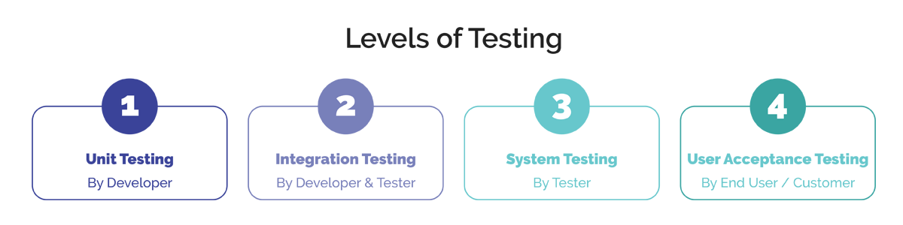

## مقدمه
در این فاز با Unit Test
و مفهوم Code Coverage
آشنا می‌شوید. همچنین برای کدی که در فازهای قبلی نوشته‌اید، تست می‌نویسید و کیفیت کد خود را بیش از پیش افزایش می‌دهید.

خوب است اما نیم‌نگاهی به مسئله تست به طور کلی داشته باشیم. در تصویر زیر می‌توانید سطوج مختلف تست را مشاهده کنید:

## مفهوم Unit Test و اهمیت آن

برای آگاهی از اهمیت نوشتن Unit Test
در فرایند توسعه نرم‌افزار، لینک‌های زیر را مطالعه کنید:

-   [Unit Testing - Important role in Software Development](https://medium.com/nonstopio/unit-testing-important-role-in-software-development-1f52f7c810f8)
-   [Why Is Unit Testing Important in Software Development?](https://performancelabus.com/unit-testing-importance/)
-   [The importance of Unit Testing](https://fortegrp.com/the-importance-of-unit-testing/)
-   [Time difference between developing with unit tests vs no tests](https://softwareengineering.stackexchange.com/questions/322256/time-difference-between-developing-with-unit-tests-vs-no-tests)

## مفهوم Code Coverage در Unit Testing و اهمیت آن

پس از مطالعه و درک مفهوم Unit Testing
و اهمیت آن در توسعۀ‌ نرم‌افزار، برای درک مفهوم Code Coverage
و اهمیت آن لینک‌های زیر را مطالعه کنید:

-   [Code Coverage - Wikipedia](https://en.wikipedia.org/wiki/Code_coverage)
-   [5 Reasons You Should Care about Code Coverage](https://eldarion.com/blog/2017/07/13/5-reasons-you-should-care-about-code-coverage/)
-   [The Importance of Code Coverage](https://blog.cloudboost.io/the-importance-of-code-coverage-9b4d513f39b4)

## نوشتن Unit Test در java با استفاده از jUnit

برای شروع کار با jUnit پیشنهاد می‌شود [Getting Started with jUnit Code](https://riptutorial.com/junit)
و [Getting Started with xUnit.net](https://xunit.net/docs/getting-started/netfx/visual-studio) را مطالعه کنید. همچنین می‌توانید نحوۀ مشاهدۀ Code Coverage
را در intelliJ Idea از طریق این لینک ببینید.
https://www.jetbrains.com/help/idea/running-test-with-coverage.html

## تاثیر اصول SOLID بر Unit Testing

برای آگاهی از تاثیر رعایت اصول SOLID
بر تست‌نویسی [SOLID, Object Oriented Design and Unit Testing](https://huestones.co.uk/2015/06/solid-object-oriented-design-and-unit-testing/)
را مطالعه کنید.

## آشنایی با Mock

یک تکنیک تست‌نویسی، Mock
کردن است که در آن، قسمتی از کد را با یک پیاده‌سازی دلخواه جایگزین می‌کنیم که از آن برای شبیه‌سازی یک عملیات واقعی استفاده می‌شود. معمولا Mock
کردن زمانی استفاده می‌شود که یک متد یا کلاس، وابستگی یا وابستگی‌هایی دارد که در تست ما تداخل نامطلوبی ایجاد می‌کند.

مثلا فرض کنید می‌خواهید سرویسی را تست کنید که در آن از یک `SmsSender`
استفاده شده‌است. در نتیجه هر بار که آن تست را اجرا کنید، یک SMS
نیز ارسال می‌شود، که این برای ما مطلوب نیست.

در این صورت، باید `SmsSender`
را Mock
کرد که دیگر SMS
ارسال نکند، ولی خروجی مشخصی بدهد. در نتیجه می‌توانیم عملکرد همان متد را تست کنیم، به جای این که بخواهیم درگیر وابستگی‌های آن شویم.

برای آشنایی بهتر با Mock
و نحوۀ استفاده این تکنیک در زبان جاوا
از لینک‌های زیر کمک بگیرید:

-   [What is a mock and when should you use it](https://stackoverflow.com/questions/214092/what-is-a-mock-and-when-should-you-use-it)
-   [Getting started with Mockito](https://www.vogella.com/tutorials/Mockito/article.html)

:::info
در مورد mockito، مطالعه ۸ مورد اول لینک قرار داده شده، به جز ۶ و ۷ کفایت می‌کند.
:::

## آشنایی با مبانی TDD

برای درک مفهوم TDD
و مراحل آن لینک‌های زیر را مطالعه کنید:

-   [Testing Software: What is TDD?](https://medium.com/javascript-scene/testing-software-what-is-tdd-459b2145405c)
-   [Test Driven Development (TDD): The Advantages and Disadvantages](https://medium.com/@stevenpcurtis.sc/test-driven-development-tdd-the-advantages-and-disadvantages-5347899ead90)

## آشنایی بیشتر با اصول SOLID و تاثیر آن بر TDD

در این مرحله، فکر کنید که هر یک از اصول SOLID،
چگونه می‌تواند بر ساده‌تر شدن روند TDD
تاثیر بگذارد. با هم‌تیمی خود در این مورد بحث کنید.

در ادامه برای درک این موضوع لینک‌های زیر را مطالعه کنید:

-   [SOLID design principles make test-driven development (TDD) faster and easier](https://medium.com/ibm-garage/solid-design-principles-makes-test-driven-development-faster-and-easier-35c9eec22ff1)
-   [Does test-driven development force me to follow SOLID?](https://softwareengineering.stackexchange.com/a/111868)

## در جستجوی تست! 

حال می‌خواهیم پروژه‌های که پیشتر ساخته‌ایم را یک قدم به محصول واقعی نزدیک‌تر کنیم و برای آن یونیت‌تست بنویسیم. با استفاده از دانشی که در این فاز بدست آورده‌اید سعی کنید برای هسته اصلی این سرویس جست‌وجو (فقط هسته اصلی!) یونیت‌تست بنویسید و coverage آن بخش از پروژه را به ۱۰۰٪ نزدیک کنید.

همچنین در این فاز می‌خواهیم قابلیت sort را به اپلیکیشن خود اضافه کنیم تا نتایج جست‌وجو به صورت مرتب شده بازگردانده شوند! در صورت تمایل پیشنهاد می‌شود این قابلیت را با رویکرد tdd به برنامه خود اضافه کنید تا مفهوم TDD را بیشتر درک کنید.

:::tip
برای مقایسه نتایج با یکدیگر و مرتب‌سازی آن‌ها می‌توانید از معیار tf/idf در حوزه بازیابی اطلاعات استفاده کنید. 
:::

